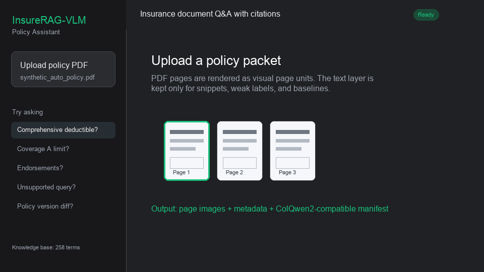

<div align="center">

# InsureRAG-VLM

### Citation-grounded hybrid multimodal RAG for insurance policy review

[](https://github.com/xiangyu2022/InsureRAG-VLM/actions/workflows/ci.yml)
[](LOCAL_SETUP.md)
[](LICENSE)

</div>

Insurance RAG breaks when the system treats a policy packet like ordinary text.
This project is built around that premise.

InsureRAG-VLM is designed for the questions that actually matter in policy packets:

- What is the deductible, limit, or premium?
- Does an endorsement override the base exclusion?
- Is the answer on the declarations page, the schedule, or the main form?
- Is the evidence strong enough to answer at all?

The default system is **not image-only** and **not text-only**.
It uses **hybrid text retrieval as the backbone**, adds **lightweight page-image layout priors**,
performs **table-aware and graph-aware retrieval**, and returns **structured answers with citations,
conflict notes, and abstention when support is weak**.

Heavy ColQwen2/ColPali-style page-image retrieval remains available as an **optional research
backend**, but it is no longer the main product path.

## Highlights

| | |
| --- | --- |
| Retrieval | Dense + sparse + lightweight page-image priors + graph expansion |
| Evidence | Snippet-to-page rollup with page citations and evidence roles |
| Insurance logic | Declarations, endorsements, exclusions, definitions, tables |
| Reliability | Structured output, conflict notes, caveats, abstention |
| Training | Dense retriever training + retrieval-conditioned QLoRA |

## Example Questions

```text
What is the personal liability limit?
Does endorsement HO-123 override the water damage exclusion?
Is cyber coverage listed on the declarations page?
What deductible applies to this claim?
What changed between policy version A and version B?
```

## Demo Walkthrough



The browser demo is designed to feel deliberate rather than noisy. It walks through the full review loop:

- Upload or select a policy PDF
- Ask deductible, limit, endorsement, exclusion, declaration, glossary, or policy-diff questions
- Inspect ranked pages, evidence snippets, and retrieval traces
- Get a structured answer with citations, confidence, conflict notes, and caveats
- Abstain when the evidence does not support a reliable answer

Run it locally:

```bash
.venv/bin/python main.py demo-web --port 7860
```

Then open `http://127.0.0.1:7860`.

## Why This Project Is Different

Most RAG systems stop at "retrieve top-k text chunks and ask an LLM."
Insurance review needs more:

- **Declarations-aware retrieval** because limits often live outside the main form text
- **Endorsement-aware reasoning** because base policy language may be modified later
- **Table-aware evidence** because deductible, premium, and schedule questions are numeric and brittle
- **Structure-aware ranking** because section titles, clause types, and form codes matter
- **Selective answering** because unsupported answers are worse than abstaining

This repo is optimized around that workflow rather than generic semantic search.

## At a Glance

| Input | Output |
| --- | --- |
| policy packet, endorsement packet, claim or billing PDF, or curated insurance dataset | grounded answer, page-level citations, evidence snippets, structured fields, conflict notes, abstention |

## What The System Returns

Input:
- a policy packet, endorsement packet, claim or billing PDF, or curated insurance dataset
- a user question

Output:
- a grounded answer
- page-level citations
- supporting snippets
- structured fields such as `coverage`, `limit`, and `evidence_role` when available
- conflict / override notes for declaration-vs-policy and endorsement-vs-exclusion cases
- abstention when support is insufficient

## Default Architecture

```text
Insurance PDFs / images
  -> document registry, hashes, and split metadata
  -> snippet / page / table corpus construction
  -> document typing, clause typing, coverage tags, section parsing, form-code hints
  -> dense text index + sparse text index + table sparse index + lightweight page-image auxiliary index + document graph
  -> query understanding
  -> dense retrieval + sparse retrieval + metadata-targeted retrieval + graph expansion
  -> reciprocal-rank fusion + insurance-aware reranking
  -> snippet-to-page rollup + insurance-logic context packing
  -> extractive / LLM answering
  -> citation validation + abstention + structured output
```

The default online path is intentionally **low latency**:

- lightweight query understanding instead of an extra LLM call
- lightweight table normalization instead of full table reconstruction
- lightweight page-image features instead of mandatory VLM inference
- rule and metadata signals before any expensive multimodal escalation

## Core Capabilities

Implemented today:

- Hybrid multimodal default retrieval with dense text, sparse text, reciprocal-rank fusion, and lightweight page-image auxiliary scoring
- Snippet-to-page rollup with insurance-logic long-context packing
- Rule-based query understanding for limits, deductibles, declarations, definitions, endorsements, exclusions, and policy-diff questions
- Lightweight section parsing with `section_titles`, `section_path`, `section_anchor`, and endorsement form-code hints
- Table extraction and normalization for limit, deductible, premium, and schedule-style evidence
- Insurance document structure heuristics for `document_type`, `clause_type`, `coverage_tags`, and graph expansion across declarations, endorsements, exclusions, and definitions
- Metadata-targeted retrieval prioritization and lightweight override/conflict summaries
- Structured answer JSON with citations, caveats, `coverage`, `limit`, `evidence_role`, `conflicts`, and `override_summary`
- Policy-version diff utilities
- Reproducible evaluation, calibration, and error-group reporting
- QLoRA SFT for Qwen 7B plus dense retriever training and retrieval-conditioned SFT data generation

Still intentionally lightweight or still in progress:

- stronger clause-level override resolution
- stronger table/layout extraction
- post-migration committed benchmark numbers for the new default stack
- gated VLM escalation for visually difficult scanned pages
- learned rerankers beyond the current low-latency rule stack

## Repository Map

Main code lives in:

- `src/insurerag_vlm/hybrid_pipeline.py`: default retrieval and answering pipeline
- `src/insurerag_vlm/query_understanding.py`: low-latency insurance query schema inference
- `src/insurerag_vlm/tables.py`: table normalization and field extraction
- `src/insurerag_vlm/graph.py`: lightweight document graph construction and expansion
- `src/insurerag_vlm/insurance_structure.py`: document typing, clause typing, section parsing, coverage tagging
- `src/insurerag_vlm/training_data.py`: retrieval triples and retrieval-conditioned SFT corpus builder
- `src/insurerag_vlm/dense_training.py`: trainable dense retriever

## Data

The repo supports two working modes:

- **Curated mode** via `data/04_curated/` for development, evaluation, and training
- **Raw PDF mode** via imported or local insurance documents for end-to-end experiments

Keep private policy documents outside Git. Commit manifests, hashes, scripts, and redacted reports,
not raw internal files.

### Local Real Policy Packets

For real policy interpretation, the preferred input is a local policy packet described with
`packet_manifest.json` so the pipeline can group:

- declarations pages
- base policy forms
- endorsements
- schedules

The manifest lets the index preserve packet-aware metadata such as `packet_id`, `document_role`,
`form_code`, and `endorsement_code` across separate files. See:

- `examples/packet_manifest.example.json`
- `reports/external_sources/policy_packet_real_sources.md`

## Current Status

The project has moved beyond the original page-image-first prototype.

What defines the current generation:

- the default stack is `hybrid_multimodal`
- the answer path is centered on `text evidence -> page citation`
- table and graph signals are first-class retrieval inputs
- the training workflow now includes:
  - retrieval triples
  - dense retriever training
  - retrieval-conditioned corpus rebuild
  - QLoRA continuation from an existing adapter

For migration details, see `reports/hybrid_multimodal/summary.md`.

## Current Reproducible State

Curated-data validation currently passes on:

- **169** RAG pages
- **1,090** snippets
- **1,259** RAG corpus records
- **3,600** SFT records
- **400** unsupported examples

The validator writes `reports/research_proof/dataset_validation.json` and regenerates
`data/04_curated/dataset_summary.json`.

Latest MSI training run:

- trained `models/retrieval/bge-base-insurerag` from the doc-disjoint retrieval corpus
- trained `models/qwen7b-insurerag-lora-retrieval` by continuing from `models/qwen7b-insurerag-lora`
- used `3231` retrieval-conditioned SFT records for `2` epochs on `1x A40`
- reached `train_loss=0.3378` with `peak_cuda_memory_mb=10930.2`
- improved the 8-sample adapter spot check over the base model from `overall_f1=0.2168` to `0.7443`
- preserved `unsupported_abstain_rate=1.0`, but did **not** beat the earlier clean-evidence adapter on answerable quote fidelity

See `reports/sft_eval/retrieval_adapter_summary.md` and
`reports/sft_eval/retrieval_adapter_spot_check.md`.

The benchmark tables already in the repo are **legacy pre-migration baselines**. They are useful as
a floor, but the result that matters next is a clean post-migration run for `hybrid_multimodal`
and `hybrid_text`, written to `reports/research_proof/`.

## Quickstart

Fastest path to a working local setup:

```bash
pip install -r requirements.txt

# 1. Download a small public insurance PDF set
python main.py import-data --output-root data --datasets public_docs

# 2. Optional smoke test
make smoke-test

# 3. Build the default hybrid multimodal index
python main.py build-index data/00_raw/external/public_docs --index-dir data --retrieval-mode hybrid_multimodal

# 4. Ask a question
python main.py query data/00_raw/external/public_docs "What coverage limits are described?" --index-dir data --top-k 3 --retrieval-mode hybrid_multimodal
```

Run the browser demo:

```bash
.venv/bin/python main.py import-data --output-root data --datasets public_docs
.venv/bin/python main.py preprocess-pages data/00_raw/external/public_docs --output-root data --render-dpi 150
.venv/bin/python main.py build-index data/00_raw/external/public_docs --index-dir data --retrieval-mode hybrid_multimodal
.venv/bin/python main.py demo-web --port 7860
```

Then open `http://127.0.0.1:7860`.

Ask for structured grounded JSON:

```bash
.venv/bin/python main.py query data/00_raw/external/public_docs \
  "What coverage limits are described?" \
  --index-dir data \
  --top-k 3 \
  --retrieval-mode hybrid_multimodal \
  --json
```

Compare policy versions:

```bash
.venv/bin/python main.py policy-diff path/to/original_policy.pdf path/to/revised_policy.pdf \
  --output reports/diff/diff_summary.json
```

For a deeper local walkthrough, see [LOCAL_SETUP.md](LOCAL_SETUP.md).

## Training

```bash
.venv/bin/python -m pip install -r requirements-gpu.txt

# 1. Build doc-disjoint retrieval triples and retrieval-conditioned SFT corpora
.venv/bin/python main.py build-training-corpora \
  --data-folder data/04_curated \
  --output-dir reports/training_data \
  --index-dir reports/training_data/index \
  --retrieval-model local-hashing \
  --retrieval-mode hybrid_multimodal \
  --corpus-source curated \
  --disable-image-signal

# 2. Train a local dense retriever
.venv/bin/python main.py train-dense-retriever \
  --dataset-path reports/training_data/retrieval_train.jsonl \
  --output-dir models/retrieval/bge-base-insurerag

# 3. Rebuild with the trained retriever and evaluate retrieval
.venv/bin/python main.py build-index data/04_curated \
  --index-dir reports/training_data/dense_index \
  --retrieval-model models/retrieval/bge-base-insurerag \
  --retrieval-mode hybrid_multimodal \
  --corpus-source curated \
  --disable-image-signal

.venv/bin/python main.py retrieval-metrics data/04_curated \
  reports/training_data/calibration_test.jsonl \
  --index-dir reports/training_data/dense_index \
  --retrieval-model models/retrieval/bge-base-insurerag \
  --retrieval-mode hybrid_multimodal \
  --corpus-source curated \
  --disable-image-signal

# 4. Continue QLoRA from the current adapter using retrieval-conditioned evidence
.venv/bin/python main.py sft-lora-qwen \
  --dataset-path reports/training_data/rag_sft_train.jsonl \
  --output-dir models/qwen7b-insurerag-lora-rag \
  --adapter-path models/qwen7b-insurerag-lora \
  --auto-resume
```

MSI GPU batch scripts for this workflow live in `scripts/`.

The latest completed MSI run and spot-check summary are documented in
`reports/sft_eval/retrieval_adapter_summary.md`.

## Optional Research Backends

The repo still includes visual-only retrieval backends for side-by-side research comparisons.
Example:

```bash
.venv/bin/python main.py build-visual-index \
  data/03_index/colqwen2/page_manifest.jsonl \
  --index-dir data/03_index/colqwen2 \
  --backend local_image

.venv/bin/python main.py visual-retrieval-metrics \
  data/02_processed/qa_pairs.jsonl \
  --index-dir data/03_index/colqwen2 \
  --backend local_image \
  --top-k 3
```

These are optional experiments, not the default serving path.

## Roadmap

## Evaluation Plan

Core metrics:
- Retrieval: Recall@5, MRR@10, nDCG@10.
- Answering: EM/F1 and ANLS for short answers.
- Evidence: citation precision and evidence recall.
- Abstention: unsupported-question accuracy and selective risk curves.
- Efficiency: p50/p95 latency, index size, and per-query cost.

Key ablations:
- Hybrid text-only vs hybrid multimodal.
- Hybrid multimodal vs optional page-image-only visual backends.
- Without vs with table retrieval and graph expansion.
- Without vs with hard negatives.
- Without vs with citation constraints.
- Qwen2.5-VL vs PaliGemma 2 / Florence-2 baselines.
- Without vs with abstention/calibration.
