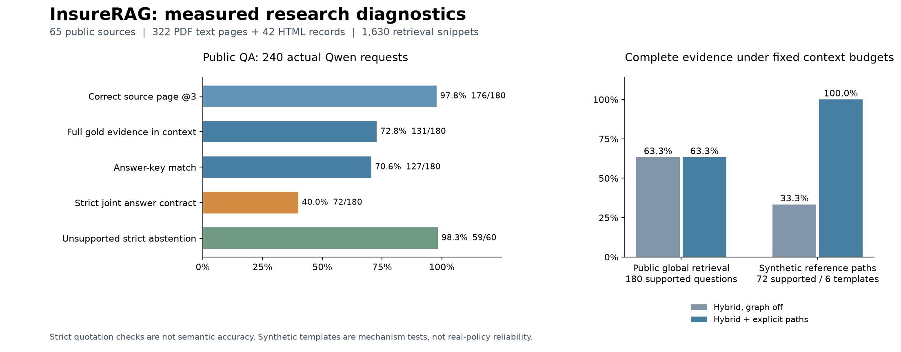

# InsureRAG-VLM

A local research prototype for citation-grounded insurance document QA. The current verified serving target is **Qwen3.5-4B through Ollama**, with hybrid retrieval, page-level evidence, explicit abstention, and an optional image-QA API.

## Research snapshot and evaluation scope

The [October 3 research release](https://github.com/xiangyu2022/InsureRAG-VLM/releases/tag/research-prototype-2026-10-03)
contains the large datasets, recorded predictions, trained checkpoints and indexes.
Git contains the implementation, compact reports, tests and source provenance.
See [asset download and restoration](docs/GITHUB_RELEASE.md) before running the
trained retrieval CLI. A normal clone is sufficient for the offline unit tests.

| Evaluation track | Public BGE-small baseline | Previous selected pipeline | Current pipeline |
| --- | ---: | ---: | ---: |
| Insurance FAQ ranking: nDCG@10, 2,000 questions | 0.4380 | 0.5255 | **0.5296** |
| Report-scoped FinQA: complete evidence@5, 1,147 questions | 62.77% | 64.52% | **72.45%** |

These are retrieval results, not generated-answer accuracy. The separate historical
Qwen test has 240 questions: 127/180 answer-key matches, 72/180 strict
answer/source/quotation-contract passes, and 59/60 strict unsupported refusals.
The latest trained retriever has not yet been evaluated end to end with Qwen on
that test. The retrieval experiment reports 5,049 questions across distinct cohorts;
they are not one insurance-only population.

For future experiments we recommend nDCG@10 for the main insurance ranking task,
complete-evidence@5 for its multi-evidence subtask, and reviewed grounded answer
accuracy for final responses. **This is a prospective recommendation:** the completed
training run used its frozen weighted MRR/complete-evidence selection protocol.
See [task and metric definitions, including nDCG@10](docs/TASKS_AND_METRICS_ZH.md).
Historical manifests retain their original creation-time status and hashes;
publication does not rewrite experiment records.

## Evidence reranker and financial-report evidence — October 3, 2026

The reranker now trains on **33,426 unique questions**, adding 2,075 original
financial-report questions to the project's training data and mining **367,338
negative pairs**. Two seeds × two epochs produced four checkpoints. The query
encoder, document vectors and candidate budget are fixed. Old-model fusion
weights are independently tuned before claiming a training gain.

Validation selected `seed_123_epoch_2`, cross weight 0.5.
New training promoted: **true**. Historical FAQ Hit@1 is
44.00% → 45.00%; Hit@10 is
75.65% → 75.85%.
These are reused historical tests; see all gains, regressions and clustered
intervals in the report.

The new **1,147-question / 278-annual-report FinQA evidence test** measures
retrieval of supporting facts within a supplied report scope. Complete evidence
in the first five results is 64.52% →
72.45%; the old model tuned on validation scores
64.52%. This is not FinQA program
execution accuracy, a new insurance-only benchmark, or evidence of unseen-company
generalization. Public pretraining exposure is unknown.

See [measured results and failure analysis](docs/EVIDENCE_RERANKER_UPDATE_ZH.md),
[reproduction](docs/EVIDENCE_RERANKER_REPRODUCTION.md),
[raw evidence](reports/evidence_reranker_v1/), and the
[selected-model retrieval CLI](scripts/query_evidence_reranker.py).
This CLI is the entry point for these trained retrieval results; the interactive
document-QA application is a separate Qwen serving workflow. Generation quality
is not measured by this experiment. One inherited FiQA near-question exposure is
retained and disclosed with a 647-row sensitivity check.

## Previous query-side adaptation and matched data ablation — October 2, 2026

Training now contains **31,351 unique questions**, including **5,464 additional
original FiQA questions** after filtering; 100 older near-duplicate questions
were additionally excluded. Two query-encoder seeds each completed two epochs.
Two further matched-budget old-question replay runs test the added supervision.
All eight checkpoints, raw scores, losses and data/model/code hashes are retained.

Validation selected seed 42 / epoch 2, blending its query vector 50/50 with the
original BGE query. Original BGE document vectors and the prior insurance
reranker remain fixed. Candidate depth stays dense100 + BM25 top100 (union ≤200);
**the selected recipe uses two query encoder passes**, so this is not an
equal-compute comparison.

| Separate test population | Public BGE Hit@10 | Previous pipeline | Query-adapted pipeline |
| --- | ---: | ---: | ---: |
| Historical insurance FAQ / 2,000 | 67.50% | 74.25% | **75.65%** |
| Historical government / 416 | 96.15% | 97.12% | 96.88% |
| Previous government / 81 | 95.06% | 96.30% | 98.77% |
| Previous general / 600 | 91.17% | 98.33% | 98.67% |
| Previous condition government / 157 | 96.82% | 99.36% | 99.36% |
| Newly added FiQA / 648 | 67.44% | 67.44% | 68.21% |

FAQ improves by **1.40 pp** over the matched previous pipeline (paired cluster
95% interval +0.65 to +2.15 pp; 44 wins / 16 losses), but FAQ Hit@1 falls from
44.80% to 44.00%. Historical government loses one hit. The new FiQA gain is
uncertain (+0.77 pp, interval −0.62 to +2.16 pp). Pure adapted dense retrieval
does not outperform public BGE on FAQ/FiQA; the gain belongs to the complete
pipeline. Historical sets have been reused, and intervals are not adjusted for
multiple comparisons.

The validation-only labelled-data ablation does **not** establish a reliable
independent benefit from adding FiQA supervision. FiQA is broad historical
finance, not a new insurance-only benchmark. One prior-reranker near-question
exposure is disclosed with a 647-question sensitivity analysis. Public-model
pretraining exposure is unknown.

See [measured findings and 777 failure/transition cases](docs/QUERY_ADAPTATION_UPDATE_ZH.md),
[reproduction](docs/QUERY_ADAPTATION_REPRODUCTION.md),
[raw evidence](reports/query_adaptation_v1/), and
[the asymmetric retrieval CLI](scripts/query_adapted_retrieval.py).
302 tests plus 58 subtests pass; three actual-model query routes pass smoke checks.
This experiment measures retrieval, not Qwen generation, GraphRAG or HNSW quality.

## Previous condition-oriented hard-negative training — October 1, 2026

That iteration expanded training to **25,987 unique questions**
(11,729 FAQ, 259 government, 13,999 general) and mines 285,857 training negatives.
Four CUDA runs across two recipes are complete. The first pairwise/public-teacher
recipe failed validation promotion and is retained as a negative result. The
listwise/specialist-retention follow-up selects **seed_123** on validation
with **union200**, lexical weight 0.2, cross weight 0.5.

**The new training adds no aggregate test Hit@10 over the validation-best
previous model in any of the five cohorts.** Candidate-pool expansion accounts
for the gains over the previous default. Some Hit@1/MRR point estimates improve;
others regress. All paired Hit@1 intervals include zero. Small positive MRR
intervals on FAQ/fresh government are exploratory and not multiplicity-adjusted.

| Separate test population | BGE Hit@10 | Previous / validation-best | Selected |
| --- | ---: | ---: | ---: |
| Historical FAQ / 2,000 | 67.50% | 74.25% | 74.25% |
| Historical government / 416 | 96.15% | 97.12% | 97.12% |
| Previous government / 81 | 95.06% | 96.30% | 96.30% |
| Previous general / 600 | 91.17% | 98.33% | 98.33% |
| Fresh government / 157 | 96.82% | 99.36% | 99.36% |

The prior model uses its own validation-optimal candidate/fusion configuration;
the full report also retains identical-config, original-config and public controls. The new 157-question
government test spans 28 URLs and 48,172 answer candidates. Earlier tests are
historical regression checks. Questions from held-out sources are excluded
from positive and negative training pairs. Two pre-training format/code fixes
are archived with their prior manifests; no test-based exclusions were made.

See [measured results and limitations](docs/CONDITION_UPDATE_ZH.md),
[reproduction instructions](docs/CONDITION_REPRODUCTION.md),
[raw evidence](reports/condition_listwise_v1/), and the
[selected-model query CLI](scripts/query_condition_listwise.py).
This is a reranker experiment, not a Qwen/GraphRAG answer-accuracy claim.

## Previous mixed-domain retention training — October 1, 2026

This earlier research iteration expands supervised training from **11,729 to 19,941
unique questions**: 213 additional publisher-written government questions and
7,999 original SQuAD crowdworker questions. A frozen public-teacher KL constraint
and mixed-domain rehearsal train the existing MiniLM reranker for two more epochs.
**Epoch 2 is selected on validation; inference uses one reranker, without ensembling.**

| Separate test population | BGE Hit@10 | Public reranker | Previous trained | Retention update |
| --- | ---: | ---: | ---: | ---: |
| InsuranceQA historical / 2,000 | 67.50% | 69.55% | 73.40% | 73.35% |
| New government / 81 | 95.06% | 96.30% | 97.53% | 96.30% |
| New general paragraphs / 600 | 91.17% | 97.33% | 93.83% | 97.50% |
| Government historical / 416 | 96.15% | 97.12% | 95.91% | 97.12% |

The new **681-question test** contains 81 government and 600 general questions
across 14 URLs and 24 Wikipedia titles; it is not 681 insurance questions. New
tests search **47,969 answer candidates**. Historical FAQ/government comparisons
retain their original 27,413/27,829 candidates. Training excludes all new held-out
source texts from positives and negatives. A pre-validation negative-sampling
issue was corrected and the rejected attempt retained.

The general-question gain over the previous model is **+3.67 pp Hit@10**
(22 wins, no losses; source-cluster 95% interval +2.39 to +5.05 pp). FAQ Hit@10
is nearly unchanged (-0.05 pp), and the five earlier historical-government misses
are recovered. The new government set loses one hit relative to the previous
model: **this is not a universal improvement claim**. Its 81 cases/14 sources
remain a small evaluation population. Historical sets are not fresh blind tests.

The updated model, source-separated data, all raw scores and error cases,
model/data/code hashes, 272 passing tests and runnable query entry point are
documented in [measured results](docs/RETENTION_UPDATE_ZH.md),
[reproduction instructions](docs/RETENTION_REPRODUCTION.md), and
[experiment artifacts](reports/retention_v2/). Use
[query_retention_reranker.py](scripts/query_retention_reranker.py) for explicit
FAQ, mixed-corpus or archived-snippet searches. BGE, Qwen and the PDF/GraphRAG
generator are separate from this training claim. Earlier experiments follow.

## Previous domain-only training — October 1, 2026

The research retrieval track now includes an **actually fine-tuned insurance
reranker**, trained on 11,729 cleaned author-labelled questions with BGE/BM25 hard
negatives. Three epochs were trained; **epoch 1 was selected on validation**.
The BGE encoder stays fixed. The 2,000-question historical test searches all
27,413 candidate answers with the same candidates and scoring rules as before.

| Historical test | Hit@1 | Hit@10 | MRR@100 |
| --- | ---: | ---: | ---: |
| BGE-small-en-v1.5 | 34.45% | 67.50% | 0.4541 |
| Previous hybrid + public MiniLM reranker | 37.35% | 69.55% | 0.4839 |
| **Hybrid + domain-trained reranker** | **43.20%** | **73.40%** | **0.5386** |

Training adds **3.85 pp Hit@10** over the previous pipeline (117 wins, 40 losses;
paired label-cluster 95% interval +2.65 to +5.09 pp). The complete pipeline exceeds
BGE alone by **5.90 pp** (+4.65 to +7.24 pp). This adds reranking computation; it
does not establish a better embedding model or better Qwen/GraphRAG answer accuracy.

A separate pinned [HICRIC](https://huggingface.co/datasets/Persius/hicric) extension
adds **4,398 unique coverage/guidance records and 78,830 snippets**. Its **416
publisher-written government Q/A pairs across 37 sources** form an additional
evaluation-only transfer test; they are not training or tuning examples. These
record/snippet counts are not independent PDF or question counts. Historical
source dates, original attribution and CC BY-SA 4.0 data terms are retained.

The independent government transfer test is a **negative result** for adaptation:
Hit@10 is **95.91% trained vs 97.12% previous reranker and 96.15% BGE**. It searches
27,829 answer candidates, not the full snippet index. The query tool therefore
retains explicit `trained` and `general` profiles; no validated automatic routing
or universal domain-transfer improvement is claimed.

See [measured results and limitations](docs/DOMAIN_TRAINING_UPDATE_ZH.md),
[training, selection and query commands](docs/DOMAIN_TRAINING_REPRODUCTION.md),
[frozen training/test artifacts](reports/domain_training_v2/), and the new
[trained retrieval CLI](scripts/query_domain_reranker.py). Model weights and large
data/index artifacts are supplied separately from Git. Earlier experiments remain
below for comparison; their scores are not relabelled as new training results.

## Previous retrieval improvement — validation-selected public reranker

The separate InsuranceQA retrieval track now includes **score fusion plus a local
MS MARCO MiniLM cross-encoder**. Parameters were selected on 2,000 validation
questions and frozen before evaluating the new method on the historical 2,000-question
test. Search covers the same 27,413 answers; original BGE/BM25 rankings match exactly.

| Historical test, same 2,000 questions | Hit@1 | Hit@10 | MRR@100 |
| --- | ---: | ---: | ---: |
| Original equal-weight RRF | 31.40% | 62.95% | 0.4184 |
| BGE-small-en-v1.5 | 34.45% | 67.50% | 0.4541 |
| Score fusion, no cross-encoder | 35.45% | 68.25% | 0.4654 |
| BGE + cross-encoder, 100-candidate ablation | 36.05% | 69.50% | 0.4729 |
| **Selected hybrid + cross-encoder, 100 candidates** | **37.35%** | **69.55%** | **0.4839** |

Against BGE, the selected method gains **2.05 percentage points at Hit@10**
(80 wins, 39 losses; paired label-cluster bootstrap 95% interval +1.00 to +3.11 pp).
Most of the improvement comes from semantic reranking: its +0.05 pp Hit@10
advantage over BGE + the same reranker is not established as a reliable hybrid gain.
Historical test results were already inspected, so this is a validation-selected
historical regression, not a newly blind benchmark. It measures FAQ answer retrieval,
not GraphRAG or Qwen policy-answer accuracy.

The reusable component is [reranker.py](src/insurerag_vlm/reranker.py); the runnable
FAQ search entry point is [query_insuranceqa.py](scripts/query_insuranceqa.py).
See [analysis, frozen protocol and reproduction commands](docs/RETRIEVAL_FUSION_UPDATE_ZH.md)
and [raw results](reports/insuranceqa_v2/rerank_test_evaluation_v1/summary.json).
The PDF-QA demo retains its separately evaluated retrieval path.

## Larger corpus and independent retrieval track — October 1, 2026

The current demo corpus has **73 documents, 1,550 PDF text pages, 42 HTML records, and 6,804 snippets**. Eight archived OPM 2026 plan brochures add **1,228 actual PDF pages** across seven plan families. The graph includes **177 source-backed printed-page links** (171 new), alongside narrowly parsed section references. Full hierarchical section IDs such as `5(a)` are preserved; ambiguous headings do not create confirmed links.

A separate, author-labeled [InsuranceQA V2](https://github.com/shuzi/insuranceQA) retrieval track adds **27,413 candidate answers, 2,000 validation questions, and 2,000 test questions across 12 insurance domains**. All 4,000 validation/test questions were run through BM25, BGE and RRF, both against all answers and the original candidate pools: **24,000 scored rankings**. In this initial baseline run, train questions were imported only for leakage auditing; no fine-tuning occurred in that run. The later domain-training experiment above uses a cleaned training subset. Original research-only use terms and attribution are retained.

| Full-corpus test retrieval (2,000 questions) | Hit@1 | Hit@10 |
| --- | ---: | ---: |
| BM25 | 23.00% | 48.25% |
| BGE-small-en-v1.5, exact search | 34.45% | 67.50% |
| BM25 + BGE, RRF | 31.40% | 62.95% |

Eight test questions exactly overlap train/validation; 476 meet a conservative lexical-similarity flag. Original results are retained with separate sensitivity slices. The 154 new real-document navigation test cases are **anchor-supplied structural diagnostics**, not independently adjudicated insurance QA. The original **240-question Qwen generation test remains a separate historical evaluation**; the new retrieval counts do not enlarge its generation denominator.

See [data, protocols, results and limitations](docs/DATA_SCALE_RESEARCH.md), [Chinese delivery notes](docs/DATA_SCALE_UPDATE_ZH.md), and the [raw retrieval report](reports/insuranceqa_v2/retrieval_frozen/summary.json). Verify all newly archived sources and fixtures with `python scripts/verify_data_scale.py`. `python scripts/demo_source_linked.py` now opens the larger corpus; add `--retrieval-mode dense_only` or `--graph-mode off` for explicit ablations.

## Earlier graph-assisted revision — historical baseline

The expanded public corpus contains **65 sources, 322 PDF text-page records, 42 HTML records, and 1,630 snippets**. A separate frozen public benchmark has **60 development + 240 test questions**, and a controlled graph diagnostic has **24 development + 96 test questions**. The graph diagnostic uses six synthetic templates; it is not 96 independent real-policy scenarios.

The graph now separates heuristic `candidate_` relations from literal source references, bounds traversal, preserves paths, and reserves context for explicit dependencies. A source-inspected pilot adds **six real printed-page references in three guides**, including the New Jersey printed-to-physical page-number offset. Neither edge type establishes legal precedence. Dense retrieval remains exact; HNSW is not part of this revision.

The actual Qwen public test completed all 240 requests: **59/60 strict refusals on unsupported questions**, **127/180 answer-key matches**, and **72/180 passes on the stricter answer + supplied-source + complete-quotation contract**. These are different diagnostics, not a single insurance accuracy or hallucination rate. The full-corpus retrieval comparison and synthetic path results are reported separately, including negative results.

Start with [research design and commands](docs/GRAPH_RESEARCH_PROTOTYPE.md), [measured results](reports/graph_research_v1/RESULTS.md), and the [source registry](data/benchmarks/research_v2/documents.json). All raw predictions, frozen inputs, code snapshots, and source hashes are retained.



```powershell
# Existing local UI with the expanded source-linked corpus; deterministic CPU smoke by default.
python scripts/demo_source_linked.py
# Actual Qwen; optional --retrieval-model C:/models/bge-small-en-v1.5 selects real BGE.
python scripts/demo_source_linked.py --vlm-model ollama:qwen3.5:4b --expected-digest 2a654d98e6fba55d452b7043684e9b57a947e393bbffa62485a7aac05ee4eefd
```

The model server must already be running at the selected loopback endpoint (default port 11435). Ask explicitly about a **guide**, **document**, or **policy** for the document-QA route; generic concept questions can use the separately labeled glossary. Model weights are not included.

The repository includes executable diagnostics, raw responses, model/data/code identities, and known failures. It does not establish production insurance decision accuracy. Public consumer guides do not identify an individual's issued policy terms.

## Current implementation

| Component | Implemented behavior |
| --- | --- |
| Answer model | Explicit ollama:qwen3.5:4b, exact tag/digest checks, non-thinking API mode, fixed decoding; failures are surfaced |
| CPU baseline | Explicit local-extractive generator and local-hashing embeddings; no LLM or hosted API is implied |
| Retrieval | Exact dense + BM25, reciprocal-rank fusion, insurance metadata, table heuristics, and bounded source-reference graph paths; graph off/explicit/all ablations |
| Real embedding option | Local BGE checkpoint with declared CLS/mean pooling and model/tokenizer/weight fingerprints |
| Evidence packing | Relevance order, duplicate removal, per-page budget, complete source identifiers |
| Answer checks | Page citations, numeric support, conflict flags, refusal/truncation guards; heuristic evidence scores are not correctness probabilities |
| Images | Explicit Qwen3.5 image-QA API tested on a public PDF page; normal RAG generation receives text |
| Demo | Local HTTP UI, transactional uploads, source-bound PDF previews, original-output panel and per-answer provenance |

Credentials alone never activate a paid provider. Another installed Ollama model never changes the requested experimental arm. Historical Qwen2.5 adapters remain identified by their actual base model.

## Run locally

Requires Python 3.11+. See [REPRODUCIBILITY.md](docs/REPRODUCIBILITY.md) for tested versions, exact model digests, Windows/Linux commands, BGE setup, and evaluation recipes.

```powershell
py -3.12 -m venv .venv
.venv/Scripts/python -m pip install -r requirements-dev.txt
$env:INSURERAG_VLM_MODEL='local-extractive'
$env:INSURERAG_USE_OLLAMA='0'
.venv/Scripts/python -m pytest -q
.venv/Scripts/python main.py demo-web --host 127.0.0.1 --port 7860
```

Open http://127.0.0.1:7860. On Linux/macOS use .venv/bin/python and the corresponding shell environment-variable syntax. The CPU mode is a deterministic baseline.

For actual Qwen3.5 inference, start [Ollama](https://docs.ollama.com/windows), then:

```powershell
ollama pull qwen3.5:4b
$env:INSURERAG_USE_OLLAMA='1'
$env:INSURERAG_VLM_MODEL='ollama:qwen3.5:4b'
$env:OLLAMA_BASE_URL='http://127.0.0.1:11434'
.venv/Scripts/python main.py demo-web --host 127.0.0.1 --port 7860
```

The research run used Ollama 0.34.2 and an 8 GB RTX 4070 Laptop GPU. This serving path does not require Python PyTorch or a paid API. Embedding/training dependencies are separate.

For a raw-document folder:

```powershell
.venv/Scripts/python main.py build-index path/to/policy-packet --corpus-source documents --index-dir data/my-packet-index
.venv/Scripts/python main.py query path/to/policy-packet "What deductible is stated?" --corpus-source documents --index-dir data/my-packet-index --json
```

Use --corpus-source curated for the committed public snapshot. A packet_manifest.json associates declarations, forms, endorsements, and versions. Keep private documents and generated indexes outside Git. This is a local single-user demo.

## Data and distinct evaluations

The historical curated snapshot contains **56 public sources, 201 page records, 1,180 snippets, and 3,850 SFT records**, including **450 unsupported examples**. The expanded research corpus above is versioned separately; the added documents are not new fine-tuning results. These are inventory counts, not expert-adjudicated benchmark size.

The original 3,400 answerable SFT rows use only **39 distinct question templates**, each mapped to multiple pages. Generic questions can work with supplied evidence but are underdetermined for global exact-source retrieval. The historical hashing diagnostic's 5.22% Hit@5 on 115 generated test rows documents that mismatch; it is not a Qwen answer error rate.

| Evaluation | What it checks | Limits |
| --- | --- | --- |
| [Frozen public guides](data/benchmarks/research_v1/README.md) | 12 development +24 test questions, document-disjoint scopes, retrieval versus oracle-evidence generation | AI-assisted/agent-reviewed annotations; old SFT contained these documents; unadapted models only; pretraining exposure unknown |
| [Synthetic PDF packets](data/benchmarks/packet_stress_v1/README.md) | 24 cases, six invented packets, ten reproducible PDFs, thirteen pages; actual application path | Regression evidence, not real-policy or hidden-test accuracy |
| Vision transport smoke | Four authored questions on one public PDF page, real pixels and image hashes | Image input/output contract only, not representative vision accuracy |
| [Image-only counterfactuals](data/benchmarks/visual_counterfactual_v1/README.md) | 12 cases across three same-layout declaration images with changed values | Clean synthetic regression; no general scan/OCR accuracy claim |
| Historical SFT audit | Actual training records, tokenizer supervision, cumulative provenance | No new-model performance is inferred from old training loss or token overlap |

Read the [fixture review](reports/research_v1/fixture_review_v1.md), [development error audit](reports/research_v1/dev_v1_error_review.md), [scoring definitions](docs/BENCHMARK_SCORING.md), and [iteration log](reports/research_iteration_log.md). Raw predictions and metadata are retained under reports/.

```powershell
.venv/Scripts/python scripts/eval_research_benchmark.py --validate-only --split test --output reports/research_v1/validation
.venv/Scripts/python scripts/eval_research_benchmark.py --endpoint http://127.0.0.1:11434 --model qwen3.5:4b --split dev --mode both --output reports/research_v1/my_dev
.venv/Scripts/python scripts/eval_packet_stress.py --endpoint http://127.0.0.1:11434 --model qwen3.5:4b --output reports/packet_stress_v1/my_run
```

Use a new output directory for every run. Preserve raw predictions when correcting metrics. Answer keys, exact quotes, citations, actual prompt evidence, and abstention answer different questions; none alone is a general hallucination rate. Wilson intervals are descriptive and omit shared-document dependence. Local timings are not a production SLA.

### Executed frozen public comparison

The test protocol and 32 source files were archived before first test inference.
Both models received identical prompts and decoding settings in all 48 paired
retrieval/oracle requests, with zero transport errors. The table shows retrieved
results on 16 supported and 8 unsupported questions.

| Measure | Qwen2.5-3B | Qwen3.5-4B |
| --- | ---: | ---: |
| Gold page retrieved | 14/16 | 14/16 |
| Frozen answer-key match | 13/16 | 12/16 |
| Strict context-grounded key/quote/page contract | 4/16 | 9/16 |
| Strict unsupported empty-field refusal contract | 2/8 | 8/8 |
| Separately reviewed complete short-answer correctness | 13/16 | 13/16 |

The new model's valid “no” answer fails one frozen key alias, which remains
unchanged. The older model's refusal-contract failures include formatting failures,
one invented personal limit, and one truncated response; they are not six factual
hallucinations. The model comparison is evidence of better adherence to this narrow
source/quote/refusal contract, not a demonstrated general accuracy gain.
Read the [paired protocol comparison](reports/research_v1/frozen_comparison/comparison.md)
and [96-response semantic review](reports/research_v1/frozen_test_semantic_review.md).

Later application fixes and longer default output budgets were evaluated separately
in [synthetic packet regression](reports/packet_stress_v1/app_v4_review.md), with
`citation_origin` distinguishing model-authored from evidence-selected citations.
The [image-only run](reports/visual_counterfactual_v1/qwen35_v1/summary.json) obtained
9/9 supported keys and 3/3 strict refusals on clean synthetic images.
The [image-removed control](reports/visual_counterfactual_v1/no_image_control_review.md)
produced three semantic refusals and one unsupported exclusion guess across four
unique prompts; only one refusal met the empty-field contract. This is a mechanism
check, not a population accuracy comparison.

## Models and historical training

The serving artifact is unadapted **Qwen3.5-4B Q4_K_M**, digest **2a654d98e6fba55d452b7043684e9b57a947e393bbffa62485a7aac05ee4eefd**. The local comparison artifact is unadapted **Qwen2.5-3B**, not the old Qwen2.5-7B LoRA adapter. Model family, size, and artifact differ; the comparison cannot isolate a pure version effect.

The recorded MSI run used **Qwen/Qwen2.5-7B-Instruct**, a text model, continuing an existing adapter on **3,231 retrieval-conditioned examples for two epochs on one A40**. It recorded training loss 0.3378 and peak CUDA allocation 10,930.2 MB. Those weights are absent from the public clone, and this training was not repeated by the serving upgrade.

The old eight-example development spot check reported token F1 0.2168 →0.7443 and four refusals out of four unsupported cases. It came from the SFT pool after earlier full-pool training. It is not a clean held-out result, a factual-error rate, or evidence that Qwen3.5 was fine-tuned.

New SFT runs record cumulative record/prompt/source/document fingerprints and parent lineage. Training rejects evaluation rows and prompt-only truncation. Held-out adapter evaluation requires an explicit dataset and complete document-disjoint provenance. See the [runtime/model card](docs/RUNTIME_MODEL_CARD.md), [evaluation audit](reports/evaluation_audit_2026-09-20.md), and [historical adapter summary](reports/sft_eval/retrieval_adapter_summary.md). Legacy GPU recipes retain the architecture they actually trained.

An actual [Qwen3.5-0.8B LoRA compatibility smoke](docs/QWEN35_LORA_SMOKE.md)
completed two synthetic optimizer steps on the local 8 GB GPU: 2,705,664 trainable
parameters, 1.93 GiB peak allocated memory, exact fresh-base save/reload forward parity.
An independent CPU audit matched all 372 saved adapter tensors and authenticated
the pinned base/tokenizer files. This separate 0.8B artifact is a compatibility check,
not fine-tuning of the 4B serving model and not evidence of improved task quality.

## Architecture

```text
Explicit document packet or public snapshot
  → page/snippet/table extraction and document metadata
  → declared embedding encoder + BM25 + graph signals
  → ranked evidence with bounded context
  → explicit generator or extractive baseline
  → citation/numeric/conflict checks and abstention
  → raw-versus-served trace and reproducible reports
```

Core code lives in src/insurerag_vlm: hybrid_pipeline.py (retrieval/context/guards), vlm.py (providers and text/image/schema interfaces), retriever.py (encoders and fingerprints), app.py (demo), and sft.py/sft_integrity.py (supervision and provenance).

Layout scores, table rules, graph relations, and refusal detection remain heuristics. Optional ColQwen2/page-image retrieval is a separate backend. Broader reliability claims require representative documents, independent expert annotations, scanned-page testing, calibrated selective answering, and fresh training/evaluation splits.

The [constructed guard counterexamples](reports/guard_adversarial_v1/README.md)
show 6 of 10 deliberately false candidate answers passing the current checks.
No model was called in that diagnostic: it demonstrates that the postprocessor
does not establish semantic entailment, even when its heuristic evidence score is high.

The [next experiments](docs/NEXT_EXPERIMENTS.md) define prospective tests for semantic
verification, representative documents/scans, and a properly controlled 4B training study.

Code license: [MIT](LICENSE). Public-source content retains its own terms.
