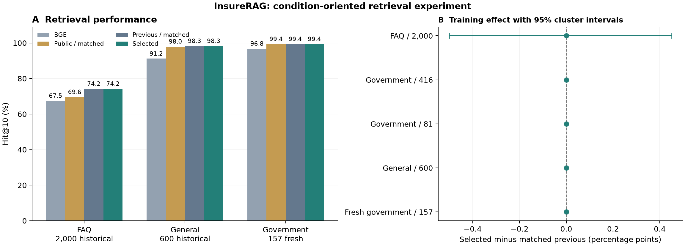

# InsureRAG 条件问答与难负例训练实测

本轮已完成数据扩充、两种损失方案共四次 GPU 训练、验证选择和固定测试。第一种方案的两个种子均未通过晋升规则，完整保留为负结果；以下为第二种方案的固定评估。新的训练权重已通过验证集选择。最终选择 `seed_123`，候选池 `union200`，BM25 权重 0.2，重排权重 0.5。

**结论：整体检索优于 BGE，但新训练没有进一步提高调好参数的旧模型的测试 Hit@10。** 五组测试的 Hit@10 均与旧模型验证最优设置相同；相对旧模型原设置的提升可由扩大候选池达到。新训练在部分首位排序和 MRR 上有进步，也在部分集合上退步，不能概括为全面提升。

## 实际结果

下表均为 Hit@10：正确标注段落出现在前十条的比例。“同设置”使用与新结果相同的候选池和融合权重，便于区分训练收益和检索设置变化。

| 测试集 | BGE | 旧模型原设置 | 旧模型验证最优设置 | 旧模型同设置 | 新选择结果 |
| --- | ---: | ---: | ---: | ---: | ---: |
| 保险 FAQ 历史测试 / 2,000 | 67.50% | 73.35% | 74.25% | 74.25% | 74.25% |
| 政府问答历史测试 / 416 | 96.15% | 97.12% | 97.12% | 97.12% | 97.12% |
| 上一轮政府测试 / 81 | 95.06% | 96.30% | 96.30% | 96.30% | 96.30% |
| 上一轮通用测试 / 600 | 91.17% | 97.50% | 98.33% | 98.33% | 98.33% |
| 本轮新政府测试 / 157 | 96.82% | 98.73% | 99.36% | 99.36% | 99.36% |

公共 MiniLM 也以原设置及同设置参加全部对照；完整 Hit@1、Hit@5、Hit@10、Hit@100、MRR 和逐题排名见 `reports/condition_listwise_v1/test_evaluation/`。不同测试使用不同候选库，不能合成一个统一“准确率”。

- **保险 FAQ 历史测试 / 2,000**：相对旧模型验证最优设置，+0.00 个百分点（95% 簇 bootstrap 区间 -0.50 至 +0.45；12 胜 / 12 负）；相对 BGE，+6.75 个百分点（95% 簇 bootstrap 区间 +5.41 至 +8.15；173 胜 / 38 负）。
- **政府问答历史测试 / 416**：相对旧模型验证最优设置，+0.00 个百分点（95% 簇 bootstrap 区间 +0.00 至 +0.00；0 胜 / 0 负）；相对 BGE，+0.96 个百分点（95% 簇 bootstrap 区间 -0.57 至 +2.73；7 胜 / 3 负）。
- **上一轮政府测试 / 81**：相对旧模型验证最优设置，+0.00 个百分点（95% 簇 bootstrap 区间 +0.00 至 +0.00；0 胜 / 0 负）；相对 BGE，+1.23 个百分点（95% 簇 bootstrap 区间 +0.00 至 +3.70；1 胜 / 0 负）。
- **上一轮通用测试 / 600**：相对旧模型验证最优设置，+0.00 个百分点（95% 簇 bootstrap 区间 +0.00 至 +0.00；0 胜 / 0 负）；相对 BGE，+7.17 个百分点（95% 簇 bootstrap 区间 +5.00 至 +9.40；43 胜 / 0 负）。
- **本轮新政府测试 / 157**：相对旧模型验证最优设置，+0.00 个百分点（95% 簇 bootstrap 区间 +0.00 至 +0.00；0 胜 / 0 负）；相对 BGE，+2.55 个百分点（95% 簇 bootstrap 区间 +0.00 至 +6.20；4 胜 / 0 负）。

首位排序的变化如下；对照为旧模型的验证最优设置。区间按 FAQ 共享标签簇或文档来源重采样，避免把同来源题目全部当作独立样本。

| 测试集 | 旧模型 Hit@1 | 新模型 Hit@1 | 差值 / 个百分点 | 95% 簇区间 / 个百分点 |
| --- | ---: | ---: | ---: | ---: |
| 保险 FAQ 历史测试 / 2,000 | 44.15% | 44.80% | +0.65 | +0.00 至 +1.30 |
| 政府问答历史测试 / 416 | 71.88% | 71.39% | -0.48 | -1.74 至 +0.94 |
| 上一轮政府测试 / 81 | 81.48% | 82.72% | +1.23 | +0.00 至 +3.30 |
| 上一轮通用测试 / 600 | 88.50% | 88.33% | -0.17 | -0.74 至 +0.38 |
| 本轮新政府测试 / 157 | 78.98% | 80.89% | +1.91 | +0.00 至 +3.76 |

所有 Hit@1 差值区间都包含零。FAQ 的 MRR@100 从 0.5467 到 0.5508（差值 0.00411，区间 0.00059 至 0.00774）；新政府集从 0.8718 到 0.8812（差值 0.00937，区间 0.00150 至 0.01928）。MRR 显示小幅排序收益，但这是事后补充分析的名义区间，未作多重比较校正；历史集合也不是新的独立测试。完整结果见 `secondary_metrics.json`。

按既有近重复标记剔除 476 道历史 FAQ 后，剩余 1,524 道的 Hit@10：BGE 68.77%、旧模型同设置 74.80%、新模型 74.67%。这项敏感性分析也不支持新增训练全面优于旧模型。

## 失败诊断如何改变了训练

上一轮保险 FAQ 的 533 道未命中题中，194 道的正确答案不在 BGE/BM25 联合候选内，34 道在候选池截为 100 条时丢失，305 道属于后续排序错误。另对 20 道 FAQ 退步题和 1 道政府退步题做了助手审阅：既有资格、主体、时间范围混淆，也有未被原标签列为正确的近似答案。后者没有擅自改成正例。

本轮据此增加当前模型会排错的难负例、同来源的相邻政府答案，以及数值/时间/条件导向的原始人工问题。第一次采用 pairwise 损失和公共模型蒸馏，验证显示保险能力退步。随后固定同一批数据和初始权重，改为列表交叉熵，并让模型保留上一版保险模型的知识。公共模型分数只用于降低疑似假负例的惩罚。两个训练设计同时改变，不能把效果单独归因于某一个因素。旧测试题只用于诊断方法方向，没有加入训练。

| 本轮固定模型 | 前十命中 | 联合候选缺失 | 候选裁剪丢失 | 排序到十名后 |
| --- | ---: | ---: | ---: | ---: |
| historical_insuranceqa | 1485 | 194 | 0 | 321 |
| historical_multidomain | 668 | 6 | 0 | 7 |
| historical_government | 404 | 3 | 0 | 9 |
| fresh_government | 156 | 0 | 0 | 1 |

完整失败卡片保留问题、原始正确答案、前三条检索结果、旧模型是否命中和失败阶段，见 `reports/condition_listwise_v1/failure_cases.json`。这些是本轮评分后的诊断，未用于重选模型。

FAQ 剩余 515 道未命中中，194 道（37.7%）在联合候选里就没有标注答案，单独继续训练重排器无法救回。扩大候选池后，原来因裁剪丢失的题目进入后续排序，因此不能把 305 到 321 的阶段计数变化直接解释为训练退步。

| 具体案例 | 当前错误 | 标注答案排名 |
| --- | --- | ---: |
| `iqa_v2_test_00398`：谁购买固定年金？ | 返回销售渠道和销售者，忽略购买者的风险偏好 | 13 |
| `iqa_v2_test_00475`：Medicare approved 的含义？ | 返回补充保险协调赔付，未优先返回该词的定义 | 16 |
| `gov2_q_c54dbbc71341f9a3`：退休人员与长期残疾人员共同参保 | 混同退休人员专属计划，忽略历史临时安排与时间条件 | 23 |
| `condgov_q_72f9a4e449c7fa4f`：医疗提供者与保险公司的合同争议 | 混同提供者非歧视、其他保障和 gag-clause 规则，未识别影响受益人权利这一条件 | 18 |

有局部修复：跨州车险题 `00627` 的正确答案从旧模型同设置第 13 到第 10；租客责任题 `01940` 从第 7 到第 5。其他题也有退步，FAQ 总 Hit@10 仍持平。以上为检索错误分析，不是对原始保险答案的现行法律或事实背书。

新政府集唯一的失败答案还存在抽取缺陷：换行后的交叉引用 `Q-A5.)` 被当成下一题，答案在 “and” 后截断。已增加独立的 v2 显式问答解析器及 6 个回归测试，在原始文档上恢复完整段落并核对字符区间。修复仅作为未来数据版本的候选；本轮数据、标签、模型、分数保持不变，也没有用修复后的段落重新计分。证据见 `boundary_repair_diagnostic.json`。

进一步筛查全部新增政府问答：46 道训练题没有触发括号/尾句检查，157 道测试题有 4 道被标记。原文复核发现其中 3 道在交叉引用处被错误切断，来自同一文档；另 1 道存在不配对括号，原因尚未判定。v2 在该文档中修复了其中 2 道，对带页码前缀、边界仍不确定的第 3 道采取拒绝抽取。未触发启发式检查不代表内容正确，仍需完整来源和专家审核。这 4 道均未删除、未重标、未重新计分。

## 数据与实际训练

- 训练问题从 **19,941 增至 25,987**：11,729 道 InsuranceQA、259 道政府问答、13,999 道 SQuAD。新增 6,046 道中，46 道属于政府问答，6,000 道属于通用条件问答，不能全部称为保险数据。
- 本轮新增独立政府测试 **157 道 / 28 个来源 URL**，搜索 **48,172 条答案**；合并 ACA 草案/最终版本后为 27 个来源家族，额外敏感性分析见 `failure_followup.json`。旧的 3,097 道测试现在只作历史回归检查。
- 285,857 个难负例来自训练问题的检索候选；新留出来源及重复文本没有进入正负训练对。测试题未用来挖掘训练负例或选择超参数。
- 政府问答逐条保留原文区间和 URL；6,000 道通用新增题逐条核对原始 SQuAD 问题与答案位置。格式抽查发现 23 条问答边界不可靠记录，已在训练和评估之前排除，保留前置快照与变更记录。
- 最终方案的两个随机种子分别实际训练 1 个 epoch，合计 **4,942 次优化更新、474,348 次问答对呈现**；计入被否决的首方案，本次总计 **9,884 次更新、948,696 次问答对呈现**。重复呈现没有计成新增数据。四份真实训练权重、全部日志和验证分数均保留。

| 随机种子 | 优化更新 | 问答对呈现 | 训练秒数 | 参数值改变数 |
| --- | ---: | ---: | ---: | ---: |
| 42 | 2,471 | 237,174 | 585.8 | 21,372,574 |
| 123 | 2,471 | 237,174 | 579.5 | 21,376,774 |

每种方案均让两种子及旧模型各比较 6 组事先登记的设置；按 0.6 FAQ、0.2 政府、0.2 通用的验证 Hit@10 加权选择，并施加各域回退限制。第二种方案是在看到第一种方案的验证退步后登记的，验证集因此被重复使用；新政府测试一直留到最后一次固定选择后才评分。完整负结果在 `reports/condition_v1/`，最终方案在 `reports/condition_listwise_v1/`。

## 仍然存在的限制

新增训练政府题中 6/46 道、新测试中 5/157 道问答对超过 512 tokens。超长不等于关键条件一定丢失，但目前仍使用固定截断；不能靠扩大训练样本解决全部长上下文问题。

政府测试使用机械抽取的公开问答，尚未经保险专家逐题审定；部分问题依赖章节背景，页眉/脚注可能残留。157 道题、28 个来源仍不足以证明跨保险产品与司法辖区的普遍有效性。原始政府资料保留历史日期，不代表现行法律结论。FAQ 标签不完整、历史集合已多次查看、公共预训练数据可能接触过文本等限制继续存在。

新政府测试中超过 512 tokens 的 5 道题均已 Hit@10 命中，因此不能把该集合的唯一失败归咎于输入截断。修复后的完整原文可能更长，未来仍需评估保留条件与交叉引用的分段方案。

本轮训练的是检索重排组件。BGE 向量模型、Qwen、图推理和 PDF 回答生成没有被这组指标验证；Hit@10 不能写成最终回答准确率。

## 下一轮应优先验证什么

优先处理第一阶段候选缺失，比较训练集上的领域向量适配和有出处的实体/关系扩展；再增加同主体、不同资格或时间条件的保险难例。新增 6,000 道通用条件题并未带来额外测试 Hit@10，继续堆通用数据的价值尚未得到证明。GraphRAG 可作为独立消融方向，但需要先构造实体、条件、适用日期和引用边，不能将本轮结果说成图检索收益。

已准备 50 道训练题的盲审队列（20 FAQ、20 政府、10 通用），标签暂空，专家完成数为 0；见 [标注指南](CONDITION_ANNOTATION_GUIDE_ZH.md)。应先核对假负例与条件标注，再登记下一轮训练和新来源测试。本轮 157 道政府题已经被查看，之后只能当回归集使用。

## 使用和复现

使用 `scripts/query_condition_listwise.py` 查询选定模型；支持 `condition`、`insuranceqa`、`hicric` 三个明确语料选项。三个入口均完成真实模型查询冒烟检查；这只验证执行，不代表回答质量审定。最终完整环境 294 项测试及 58 项子测试通过，最小环境 273 项通过、9 项按依赖跳过，另有 58 项子测试通过。

数据、模型、代码、原始分数和选择顺序均有 SHA-256 记录。详情见 [复现说明](CONDITION_REPRODUCTION.md)、`reports/condition_listwise_v1/verification.json` 与 `delivery_checks.json`。
