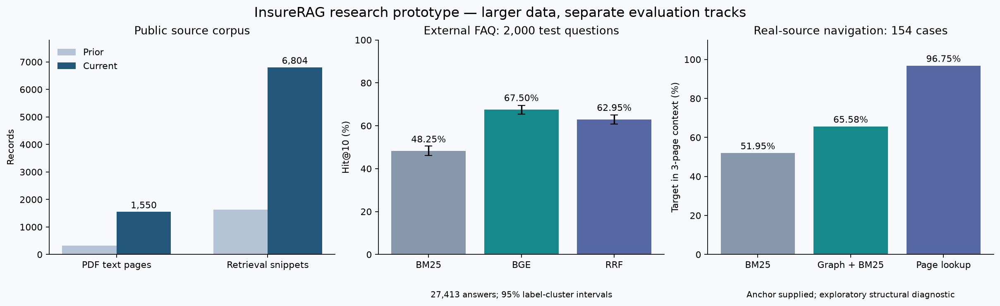

# Data scale revision, October 1, 2026

The revision addresses two different shortages: too little source material and
too few externally labeled retrieval questions. It does not manufacture new
independent examples by changing numbers in six synthetic packet templates.

## Source corpus

| Inventory | Previous | Current |
| --- | ---: | ---: |
| Source documents | 65 | 73 |
| PDF pages with native text | 322 | 1,550 |
| HTML pseudo-pages | 42 | 42 |
| Snippets | 1,630 | 6,804 |
| Verified-literal printed-page links | 6 | 177 |

Eight OPM-published 2026 health plan brochures add 1,228 physical pages and 5,174
snippets. Seven plan families cover APWU, GEHA (two variants kept together),
SAMBA, NALC, MHBP, Compass Rose and Foreign Service. These include FEHB and PSHB
wordings, cost-share tables, exclusions, eligibility, precertification and claims
procedures. They are archived benefit documents; no personal declarations or
actual customer claims have been invented. All eight use an OPM brochure format,
so additional pages do not imply eight new document genres.

`policy_wordings_v1` stores the original PDFs, acquisition registry, native text,
1,212 printed footer mappings, 171 new distinct page links and rejected links.
`scaled_public_v2` combines this with the previous corpus. Seventeen locally
archived PDFs are copied into its safe preview root so the existing application
can open their citations. Every byte and text record is hash checked; all 1,228
new pages were re-extracted for verification. Native text can flatten multi-column
tables; table understanding and multimodal QA accuracy are not established.

## Evaluation tracks and actual denominators

| Track | Development/validation | Test | What was run |
| --- | ---: | ---: | --- |
| Original grounded public-guide QA | 60 | 240 | Historical Qwen3.5 generation; preserved |
| External InsuranceQA V2 | 2,000 | 2,000 | BM25/BGE/RRF × global/original pools, all questions |
| Real OPM page navigation | 17 | 154 | Three anchor-supplied navigation arms |
| Original synthetic graph paths | 24 | 96 | Historical controlled mechanism study |

Do not sum these rows into a single end-to-end accuracy denominator. There are
**2,000 newly evaluated external retrieval test questions**, not 2,000 newly
evaluated Qwen insurance answers. This revision performs no new LLM generation.
An expanded, independently expert-adjudicated real-policy generation set is
still missing; the additional navigation cases do not provide that validation.

InsuranceQA has 27,413 answer candidates and 12 question domains. Its original
12,889 training questions are used for auditing only. Main scores preserve the
original splits and all failed queries, including questions whose official
candidate pool lacks a positive. The upstream authors' research-only use terms
and original attribution remain attached to the data.

## External retrieval results

| Test, search all 27,413 answers | Hit@1 | Hit@10 | MRR@100 |
| --- | ---: | ---: | ---: |
| BM25 | 23.00% | 48.25% | 0.3144 |
| BGE-small-en-v1.5 | 34.45% | 67.50% | 0.4541 |
| Reciprocal-rank fusion | 31.40% | 62.95% | 0.4184 |

These are answer-ID retrieval scores. No gold answer was appended to a candidate
list. The original SOLR-1,000 test pools include a positive for 1,744/2,000 questions;
BGE Hit@10 there is 65.60%, with all 2,000 in the denominator. Searching all answers
is the primary, reproducible retrieval comparison; it is not the original paper's
trained answer-selection result.

The label-sharing cluster bootstrap gives BGE global Hit@10 a 95% interval of
65.48–69.55%. A paired BGE-minus-RRF interval is +2.95 to +6.24 percentage points.
The 1,995 connected label groups are almost question-sized; these intervals do
not remove all topical dependence or unknown model pretraining exposure.

Eight exact normalized test overlaps are reported, with separate 1,992-question
slices. A post-hoc char-ngram similarity audit flags 476 test questions at cosine
≥0.92 against train/validation. On the remaining 1,524, BGE Hit@10 is 68.77%.
This is a lexical sensitivity slice, not expert semantic deduplication or a new
benchmark. Unlabeled semantically valid answers can still be counted as failures.

All 4,000 validation/test questions, three retrieval arms and two search spaces
produced 24,000 ranked outputs. Protocols record fixed settings, data/model/code
hashes, exact retrieval, truncation count, per-domain results and timing. No
HNSW was required at this corpus size, and no HNSW speed claim was measured.

## Source navigation and implementation correction

With the anchor supplied and a three-page context, the 154-case exploratory
navigation comparison finds the target in 80 cases (51.95%) for BM25, 101
(65.58%) for bounded graph expansion, and 149 (96.75%) for direct printed-page
lookup. Direct lookup parses the input without reading target labels. This is
evidence for keeping explicit references resolvable, not a claim that a graph is
better than all simpler baselines. Per-family results are reported; SAMBA makes
up 83/154 cases. A faulty first lookup arm is explicitly invalidated and retained;
the corrected run is post-hoc and exploratory.

The larger corpus exposed a real parser defect: `Section 5(a)` could previously
match `Section 5`. The parser now preserves full parenthesized addresses, rejects
unsupported suffixes, and deduplicates repeated mentions. The index schema is
version 4 so older indexes cannot silently reuse the incorrect graph. The final
combined corpus produces 177 mapped page links and 356 unique narrow section
links. These 533 explicit links assert source references, never legal priority.

## Full-corpus regression on historical questions

The existing 240 public-guide questions were searched against all 73 documents,
with real BGE embeddings and the application's retrieval/context pipeline. This
adds distractor documents without relabeling or counting old questions as new.
All 720 scheduled arm/query combinations completed; generation calls were zero.

| Mode, 180 answerable questions | Any gold page in top 3 | Complete gold span in context |
| --- | ---: | ---: |
| Graph off | 81.67% | 64.44% |
| Explicit graph | 80.56% | 63.33% |
| All candidate + explicit graph | 80.56% | 63.33% |

This comparison does not establish a public-QA gain from graph expansion.
The real reference navigation diagnostic and the synthetic graph mechanism
result must not be substituted for this more difficult evidence-completeness
endpoint. The original Qwen generation metrics are retained as historical
measurements; they were not remeasured on the larger corpus.



## Reproduce

```powershell
python -m pip install -r requirements-scale.txt
python scripts/verify_data_scale.py
python scripts/eval_insuranceqa_scale.py --model C:/models/bge-small-en-v1.5 --device cpu --output reports/insuranceqa_v2/new_run
python scripts/eval_policy_navigation.py --output reports/opm_reference_navigation_v1/new_run
python scripts/demo_source_linked.py
```

`--device cuda` was used for the external BGE run on an RTX 4070 Laptop. Model
weights and environments are not included. The demo defaults to explicit
local-hashing/local-extractive diagnostics; specify the local BGE path and exact
Qwen digest for actual model serving. Optional `--retrieval-mode dense_only` and
`--graph-mode off` expose ablations without changing archived benchmarks.

Source acquisition and decoding scripts are included. To recreate PDF acquisition
into a new folder while checking archived hashes:

```powershell
python scripts/acquire_policy_wordings.py --output data/research_corpus/opm_redownload --expected-registry data/research_corpus/policy_wordings_v1/acquisition.json
```

An upstream byte change fails validation; it is not silently substituted into
the frozen fixture. The fresh all-73-source regression uses the old 240 questions
and is reported under `reports/expanded_retrieval_v1/scaled_public_regression_gpu`.
It is a corpus-size regression, not 240 additional held-out questions.
