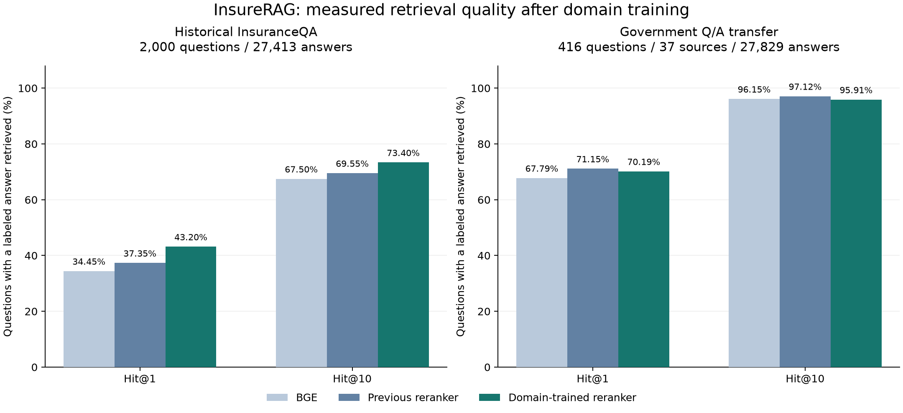

# InsureRAG：数据扩充与真实领域训练

更新日期：2026-10-01。目标是可复现、如实报告局限的 research prototype。

**保险 FAQ 检索得到实测改善：历史测试 Hit@10 从 BGE 的 67.50%、上一版的
69.55%，提升至 73.40%。独立政府问答迁移测试则出现退步，因此目前不能声称
“所有保险文本都更好”。** 两类结果与全部原始预测一起保留。

## 这次增加了什么

| 数据 | 实际规模 | 用途与口径 |
| --- | ---: | --- |
| 公开保险覆盖、监管材料 | 4,398 条去重记录，1,115 个来源 URL | 新的 HICRIC 历史语料；不是 4,398 份独立 PDF |
| 检索片段 | 78,830 条 | 按原文固定窗口切分；不是独立问题数量 |
| 政府原文问答 | 416 问 / 416 答，37 个来源 | 单独的迁移测试；不用于训练或调参 |
| 清理后的 InsuranceQA 训练题 | 11,729 道 | 保留原作者题目与正例标注 |
| 可用正例问答对 | 19,193 对 | 三个 epoch 实际轮换用到 17,994 对不同正例 |
| 挖掘的负例问答对 | 105,561 对 | 每题 4 个 BGE 难例、4 个 BM25 难例、1 个随机例 |
| 原验证 / 历史测试 | 各 2,000 道 | 在全部 27,413 个候选答案中检索 |

新增语料来自 [HICRIC](https://huggingface.co/datasets/Persius/hicric)，固定 revision
`e9304975feff9ccaaf15cf547f698590d00d78c3`。下载的两个配置共 4,771 条，合并 373 条
重复文本后留下 4,398 条。来源归档访问日期为 2024 年 1 月，保留 CMS、Medicaid、
DOL 等原始来源、上游行号、内容哈希及 CC BY-SA 4.0 署名。归档内容不代表现行规则。

416 道迁移测试题来自发布机构原文的编号问答，非 LLM 批量改写。逐条检查原文字符
位置；拒绝不匹配的题号/答案号、部分依赖省略上下文的问题、过长答案和同题异答。
与最终训练题没有精确重复，也没有达到字符 TF-IDF 0.92 阈值的近似重复，最高相似度
约 0.680。另按每个来源抽查一例，共 37 例。这个审查仍不是独立保险专家标注；脚注、
缩写、上下文依赖和未标注的合理答案仍可能影响分数。

## 真实训练与选模

训练对象是 **22.7M 参数的 MiniLM cross-encoder 排序模型**。BGE 编码器保持固定。
模型读取问题和候选答案文本，学习重新排序；Qwen 生成模型没有在这一轮重新训练。

原 12,889 道训练题清理后保留 11,729 道：删除内部重复题、与验证/测试近似重复的题，
以及与留出集共享正例答案 ID 或答案文本的题。自查发现第一次清理遗漏了 10 道
“答案 ID 不同、文本相同”的题，因此中止第一版测试评分，在计算其测试指标之前
修正数据并从原始公开模型重新训练。旧训练、旧验证与部分测试评分保留并标为
`NOT_SELECTED.md`，不作为最终结果。

每组训练样本是一个原作者正例、两个 BGE 难负例、两个 BM25 难负例和一个随机负例。
使用 listwise cross entropy、0.05 label smoothing、AdamW、学习率 2e-5、10% warmup、
有效 batch 16 组；FP32 参数配合 BF16 autocast。负例是未被标为正例的检索候选，
不是人工确认错误的答案。

| Epoch | 平均训练 loss | 验证 Hit@10（该轮最佳融合权重） |
| --- | ---: | ---: |
| 1 | 1.5521 | **74.30%** |
| 2 | 1.1187 | 73.40% |
| 3 | 1.0351 | 73.65% |

完整训练为 **3 个 epoch、2,202 次 optimizer step、211,122 次问答对呈现**，耗时约
468.5 秒，GPU 为 RTX 4070 Laptop 8GB。21 万次呈现包含重复训练，不能写成 21 万条
独立样本。实验只有一个随机种子，还没有跨种子稳定性结论。

按预先固定的规则，在 2,000 道验证题上选择 epoch 和四档融合权重。最终选中
**epoch 1**，而非最后一轮：该检查点实际经历 734 次更新、70,374 次问答对呈现。
loss 继续降低，没有带来验证 Hit@10 持续提升。

实际参数比对确认：105 个参数张量都发生了更新，22,713,601 个参数中
22,713,566 个值与公开基座不同；并非只改模型名称或配置。
选中权重 SHA-256：`88207632c798e8a5a7eb2799447dc1f1f08aec03daaa142b31fb29572a2071fe`。

## 历史测试：确实更好，但有明确范围

同一组 2,000 道题、同一组 27,413 个候选答案。Hit@10 表示前十个结果里是否出现
至少一个原标注答案；Hit@1 是首位命中，MRR@100 反映正确答案的排序位置。

| 检索方案 | Hit@1 | Hit@10 | MRR@100 |
| --- | ---: | ---: | ---: |
| 原等权 RRF | 31.40% | 62.95% | 0.4184 |
| BGE 单独检索 | 34.45% | 67.50% | 0.4541 |
| 上一版：混合检索 + 公开 MiniLM | 37.35% | 69.55% | 0.4839 |
| BGE 候选 + 本次训练的 MiniLM | 40.85% | 72.45% | 0.5185 |
| **混合检索 + 本次训练的 MiniLM** | **43.20%** | **73.40%** | **0.5386** |

相对 BGE，Hit@10 **+5.90 个百分点**，151 道新增命中、33 道失去命中；配对标签簇
bootstrap 95% 区间为 **+4.65～+7.24 个百分点**。相对上一版，**+3.85 个百分点**，
117 道新增、40 道失去；区间 **+2.65～+5.09 个百分点**。

融合设置与上一版完全相同，训练前后主要变化是排序器权重，因此这组比较支持领域
训练带来改善。相对“BGE 候选 + 同一训练模型”，混合候选再多 **0.95 个百分点**
（35 胜、16 负；区间 +0.25～+1.65）。这个候选池消融使用相同融合权重，不代表对
BGE-only reranker 进行了独立最优调参。

检索器先合并 BGE 和 BM25 各前 100，再保留 hybrid100 排序池；原等权 RRF 中较弱的
关键词结果容易挤掉语义更好的结果。现在保留 BGE 的语义信号，并让训练模型学习
保险 FAQ 中的相关性区别。排序器需要额外计算：评分缓存实际对最多 200 个并集候选
计算神经分数，再复用给不同消融；不能把结果写成与单独 BGE 相同成本的提升。

历史测试在更早的迭代中已经查看过，因此不是新的盲测。保留全部 2,000 题，并另外
报告旧近似重复标记排除后的 1,524 题：BGE **68.77%**、上一版 **70.80%**、训练版
**74.02%**。12 个领域中 10 个提升、1 个持平；17 题的重疾险子集下降 1 个命中。

40 道退步题也保留了分析。例如，含特定年龄条件的问题可能被更泛化的年龄条件
答案挤掉；部分作者只标了一个答案，而另一些候选看起来也相关。前者说明数值与
资格条件匹配仍有问题，后者说明标注不完备。没有因此删除测试题、修改答案或重新调参。

## 独立迁移测试：不能隐藏的退步

416 道政府问答在选模前冻结，未参与训练、选模或融合调参。所有方案使用相同的
**27,829 个候选答案**，包含 27,413 个 InsuranceQA 答案和 416 个政府答案。
政府答案候选不附带原问题，正确答案也没有被强行插入各题检索候选。

| 方案 | Hit@1 | Hit@10 | MRR@100 |
| --- | ---: | ---: | ---: |
| BGE | 67.79% | 96.15% | 0.7782 |
| 上一版通用排序模型 | **71.15%** | **97.12%** | **0.8051** |
| 本次领域训练模型 | 70.19% | 95.91% | 0.7975 |

训练版比 BGE 少命中 1 题，Hit@10 差 **−0.24 个百分点**；按 37 个来源 URL 分簇的
95% 区间为 **−1.31～+0.86 个百分点**。比上一版少 5 题，差 **−1.20 个百分点**，
来源簇区间为 **−2.25～−0.31**。416 道题不能视作 416 个独立来源。

这与领域适配存在迁移代价的解释一致，但单个训练种子不足以确定原因。消费保险 FAQ
与政府监管问答的文本风格、问题类型不同。训练版在前者明显改善，后者没有得到提升。
因此查询工具同时保留 `trained` 和 `general` 两个显式选项；政府材料示例使用原通用
模型。这是看到诊断后的使用建议，不是经过新盲测的自动路由系统。

78,830 片段的完整 HICRIC 查询是另一种检索任务。不能把本节的答案候选评估成绩
移植成“7.8 万片段检索准确率”，也不能改写为 Qwen 回答正确率或 GraphRAG 提升。

## 可运行内容与交付

训练、选模、推断、来源审查、指标复算和权重变更验证都已提供脚本。
完整命令见 [复现说明](DOMAIN_TRAINING_REPRODUCTION.md)。FAQ 的 CPU 查询已运行；
78,830 × 384 维新索引已构建，耗时约 222 秒，543 个片段在编码时被截断到 512 tokens，
原片段文本仍完整保留。通用模型和训练模型均已完成实际新语料查询，返回原始 URL 与
文本位置。查询程序读取文本与候选库，不读取测试标签；这些 smoke run 验证可运行性，
不构成带标注的片段检索准确率评估。

- [最终模型选择](../reports/domain_training_v2/selection.lock.json)
- [历史测试原始指标](../reports/domain_training_v2/test_evaluation/summary.json)
- [迁移测试原始指标](../reports/hicric_government_qa_v1/transfer_v1/summary.json)
- [参数更新、数据与指标完整性验证](../reports/domain_training_v2/verification.json)
- [训练曝光次数审计](../reports/domain_training_v2/supervision_exposure_audit.json)
- [所有退步题与领域分析](../reports/domain_training_v2/error_analysis.json)
- [公开语料说明与许可](../data/research_corpus/hicric_public_v1/README.md)

源代码包、选中模型权重包、公开数据与索引包分开交付，保留上一轮产物。解压到同一
父目录即可：`InsureRAG-VLM` 为仓库目录，`models` 为其相邻目录。原始 BGE / 公开
MiniLM 权重按固定版本从原发布者获取。InsuranceQA 的原研究用途条款继续适用。

代码回归：完整环境 **265 项通过、58 个子测试通过**；最小依赖环境
**258 项通过、7 项按缺失可选依赖跳过、58 个子测试通过**。数值、引用和多页条款
推理仍需单独验证；先前 PDF 演示中的计划身份路由、数值归属及图上下文问题仍记录在
[已知局限](KNOWN_LIMITATIONS.md)。

## 可用于简历的准确表述

“构建含 78,830 个公开保险与监管文本片段的研究语料；利用 11,729 道去重保险问答
和 BGE/BM25 难负例微调 22.7M 参数重排器，在 2,000 题历史全库检索测试中，将
Hit@10 从 BGE 基线 67.50% 提升至 73.40%，并建立 416 题、37 来源的独立迁移诊断，
保留领域外退步结果与可复现训练、选模及来源审计流程。”

下一步最值得研究的是数值/资格条件难例、原模型与领域模型的遗忘控制，以及与最终
测试来源分离的新训练数据。任何新增策略都应使用新的开发集，不能继续针对这 416
道已查看过的迁移测试题挑参数。
