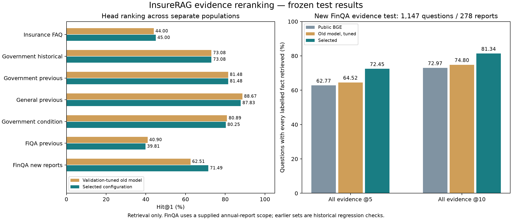

# InsureRAG 首位排序与财报证据训练

新训练通过了事先锁定的验证晋升规则，以下为一次固定选择后的测试。 本轮选定 `seed_123_epoch_2`，重排融合权重 `0.5`；旧模型也独立比较同一组三种权重，验证最优为 `0.5`。不能把调整融合参数的收益全部算成模型训练收益。

本轮增加 2,075 道实际进入梯度训练的原始财报问题，重新挖掘 367,338 个训练负例，完成两种子、各两轮训练。固定了上一轮查询编码器和 BGE 文档索引，训练重排器并在验证集比较三种融合权重；本次新旧最终融合权重均为 0.5，差异来自新重排权重。相对上一轮流程，候选深度与查询编码次数不变；相对单独 BGE，完整流程仍有两次查询编码及额外重排计算。

**固定测试的主要变化：** FAQ Hit@1 从 44.00% 到 45.00%，31 题改善、11 题退步，差值及名义 95% 簇区间为 +1.00（+0.35, +1.60） 个百分点；这是重复使用的历史测试，不能当成全新独立验证。FAQ Hit@10 变化 +0.20 个百分点，区间包含 0，尚不能认定稳定变化。新财报完整证据@5 变化 +7.93 个百分点，名义区间未跨 0。首位命中的点估计回退包括：此前通用集 88.67% → 87.83%；条件政府集 80.89% → 80.25%；上一轮金融论坛集 40.90% → 39.81%。各任务需分别解读，不能概括为全面提升。

## 测试结果

Hit@10 表示找到至少一条原始标注证据，并非生成答案正确率。公共 BGE 指 `BAAI/bge-small-en-v1.5`，不是所有 BGE 型号。

| 测试集 / 题数 | BGE Hit@10 | 上轮流程 Hit@10 | 旧模型验证最优 Hit@10 | 本轮选定 Hit@10 | 上轮 → 本轮 Hit@1 |
| --- | ---: | ---: | ---: | ---: | ---: |
| 保险 FAQ 历史集 / 2,000 | 67.50% | 75.65% | 75.65% | 75.85% | 44.00% → 45.00% |
| 政府历史集 / 416 | 96.15% | 96.88% | 96.88% | 97.12% | 73.08% → 73.08% |
| 此前政府集 / 81 | 95.06% | 98.77% | 98.77% | 98.77% | 81.48% → 81.48% |
| 此前通用集 / 600 | 91.17% | 98.67% | 98.67% | 98.67% | 88.67% → 87.83% |
| 条件政府集 / 157 | 96.82% | 99.36% | 99.36% | 99.36% | 80.89% → 80.25% |
| 上一轮金融论坛集 / 648 | 67.44% | 68.21% | 68.21% | 68.36% | 40.90% → 39.81% |
| 新财报证据集 / 1,147 | 92.15% | 92.85% | 92.85% | 96.60% | 62.51% → 71.49% |

下表比较本轮选定配置与**旧模型的验证最优配置**。区间为 5,000 次配对簇 bootstrap，FAQ / FiQA 按共享标注答案，政府 / 通用按来源，FinQA 按年度报告。多指标、多集合比较未作多重检验校正；历史测试已经多次被查看。完整的同权重旧模型对照另存于 `test_metrics.csv` 和原始报告中。

| 测试集 | Hit@1 差值 / 百分点（95% 簇区间） | Hit@10 差值 / 百分点（95% 簇区间） | MRR 差值（95% 簇区间） |
| --- | ---: | ---: | ---: |
| 保险 FAQ 历史集 | +1.00（+0.35, +1.60） | +0.20（-0.35, +0.75） | +0.0067（+0.0031, +0.0103） |
| 政府历史集 | +0.00（-1.33, +1.38） | +0.24（+0.00, +0.82） | -0.0008（-0.0086, +0.0066） |
| 此前政府集 | +0.00（-4.63, +5.00） | +0.00（+0.00, +0.00） | +0.0014（-0.0219, +0.0270） |
| 此前通用集 | -0.83（-1.64, +0.00） | +0.00（-0.48, +0.47） | -0.0039（-0.0082, +0.0004） |
| 条件政府集 | -0.64（-2.38, +0.00） | +0.00（+0.00, +0.00） | -0.0019（-0.0113, +0.0052） |
| 上一轮金融论坛集 | -1.08（-2.78, +0.46） | +0.15（-1.54, +1.85） | -0.0057（-0.0167, +0.0049） |
| 新财报证据集 | +8.98（+6.50, +11.49） | +3.75（+2.24, +5.32） | +0.0801（+0.0642, +0.0958） |

## 新增测试：是否找齐回答需要的事实

新的 1,147 道 FinQA 问题来自 278 份年度报告、380 个原始页面和 100 家公司。每题给定公司 / 年度报告范围，检索该报告在数据集中发布的全部页面；不提供正确页面或正确行。这是本项目定义的报告范围证据检索任务，与 FinQA 官方单页输入、程序执行准确率不能直接横向比较。

原始测试包含 9 组同报告内重复问题，按忽略大小写及空白差异计为 1,138 个不同的“报告 + 问题”组合。全部原始记录保留；按问题组等权的次要敏感性结果中，前五完整证据命中率为旧模型验证最优 64.59%、本轮选定 72.58%。不能把 1,147 条记录称为 1,147 个完全独立样本。

原题基于特定页面提问，扩展到整份报告的已发布页面后，可能出现指代不明确或其他页面存在相同事实的问题。主指标严格按原始证据 ID；若允许同一报告内完全相同的证据文本互相替代（只规范空白并去重），前五完整证据命中为旧模型验证最优 64.52%、本轮选定 72.45%。这是标注敏感性检查，不是对语义等价或问题歧义的专家裁定。

| 指标 / 1,147 题 | 公共 BGE | 上轮流程 | 旧模型验证最优 | 本轮选定 |
| --- | ---: | ---: | ---: | ---: |
| 首条命中至少一条事实 | 59.20% | 62.51% | 62.51% | 71.49% |
| 前五包含全部标注事实 | 62.77% | 64.52% | 64.52% | 72.45% |
| 前十包含全部标注事实 | 72.97% | 74.80% | 74.80% | 81.34% |
| 前五事实召回比例 | 74.89% | 75.43% | 75.43% | 82.89% |

相对旧模型验证最优，“前五找齐全部事实”的差值为 +7.93（+5.75, +10.22） 个百分点。按公司重采样的敏感性区间为 +7.93（+5.91, +9.89） 个百分点；更粗的分组用于检查同公司不同年份之间的依赖。2 道题需要超过五条事实，因此前五完整命中的理论上限为 99.83%，同时报告前十指标。

候选报告的源行数最少 8、中位数 161、最多 969；各方法使用相同范围。多个事实题和单事实题分别统计，详见 `failure_analysis.json`。

其中 568 道只需一条标注事实，前五完整命中率由 91.20% 变为 95.77%；579 道需多条事实，相应指标由 38.34% 变为 49.57%。这些是事后分层描述，不用于再次选模型。

这些是财报分析题，并非新增 1,147 道保险业务题。仅 4 道新测试问题命中预先说明的保险关键词，规模不足以得出保险子域结论。86 家公司在实际训练和测试的不同年份出现，所以这里只保证年度报告隔离，不宣称公司隔离。原始公开数据可能进入公共基础模型预训练，接触情况未知。

## 失败分析怎样影响了本轮设计

上轮 FAQ 的 38 道首位退步题中，24 道在固定重排器单独排序时标注答案仍为第一，14 道连重排器也排序错误。前者提示融合影响，但单纯加大重排权重在完整验证集上反而退步：FAQ Hit@1 在权重 0.5 / 0.75 / 1.0 时为 43.10% / 42.70% / 37.30%。因此没有根据局部案例直接手调一个测试最优权重。

重新挖掘训练候选后，5,914 / 11,629 道保险 FAQ、3,491 / 5,464 道 FiQA、856 / 2,075 道财报训练题存在未标注候选得分不低于最佳原始正例。它们不全是可靠错误：部分候选可能是漏标的合理回答。对非 FinQA 数据中的可疑负例降低权重，但不改成虚构正例；保留源标签和具体文本供审核。

训练目标在列表交叉熵外加入关注靠前名次的成对损失，并用旧重排器的 KL 约束减轻遗忘。名次权重使用交换正负例后的倒数排名差，停止梯度。每次呈现一个按轮次循环的原始正例和五个不同负例，已知其他正例及相同文本不会进入负例池。新增数据、挖掘方式与损失同时改变，因此结果属于组合方案，不能单独归因于某个因素或宣称新方法 SOTA。

本轮保留了 2,194 张失败和排名变化卡片：FAQ 等集合检查首位命中，FinQA 检查前五是否找齐事实。卡片含问题、原始标注、完整候选内正例名次、前五结果和旧 / 新对照。未删坏例、未改测试标签，案例由助手诊断，专家复核完成数为 0。

FAQ 仍有 176 题的标注答案完全不在固定候选池中，另有 307 题虽被召回却排在前十之后；单独重排无法补救前者。FinQA 的 26 题候选中缺少至少一条原始标注事实，另有 290 题候选中事实齐全但前五未找齐。多事实题完整证据命中只有 49.57%，仍是明显短板。

以下是助手逐例检查的具体得失，不是随机抽样的错误率估计，也未进行专家业务裁定。原文和完整排名见[测试案例复核](../reports/evidence_reranker_v1/reviewed_test_cases.json)。

| 测试案例 | 标注指标变化 | 逐例观察 |
| --- | --- | --- |
| `iqa_v2_test_00035` | 改善 | **意图匹配改善**：问题询问失能保险的基础知识；旧首条偏向投保资格，新首条转向保障作用和等待期。这是与原始标注意图更接近，不构成对原文保险或税务说法的当前事实核验。 |
| `iqa_v2_test_00432` | 退步 | **受损对象与险种情境错配**：问题场景是汽车撞到行人。原标注指向人身伤害责任，新首条转向泛化车险报案及车辆损失文本；标注答案降至第 2。主题相近仍可能遗漏受损对象这一关键条件。 |
| `iqa_v2_test_00262` | 退步 | **原始标签可能不穷尽合理答案**：原标注答案由第 1 降至第 2，新首条也讨论移除受抚养人的保障及个体/团体计划条件。它属于确定的 ID 标签失分，但是否为真实业务退步需要专家复核；本轮不据此重标。 |
| `finqa_q_847421011236c2e635bc78d5` | 改善 | **分子和分母行共同进入前五**：股票奖励占总收购价的问题，两个原始标注行在新模型下进入第 5 和第 3。未运行数值计算。原 FinQA 表格文本化可能把首行数据作为列名，文字表述仍有抽取格式局限。 |
| `finqa_q_668b3f95d2c3b60851237141` | 退步 | **表头落后于数值行**：数值行升到第 1，但表头从第 1 降至第 8，严格完整证据@5 因而失分。列名和时间信息也出现在序列化数值行中；该指标不等价于最小充分证据或最终算术正确性。 |
| `fiqa_q_98` | 改善 | **命中标注不等于建议质量提升**：首位命中的原始标注答案带有反讽性质：以更大的初始资金回应目标收益问题。此次标签命中增加不能解释为可执行金融建议变得更好。 |
| `fiqa_q_1812` | 退步 | **决策意图错配**：原题涉及共有住房及共同房贷的分配安排，新首条转向把共有房产用于贷款抵押。仍围绕共有产权，但偏离分配责任的决策情境；原标注答案在第 4 和第 7。 |

第一份 checkpoint（种子 42、第 1 轮）的[四个验证案例复核](../reports/evidence_reranker_v1/validation_case_review.json)进一步揭示两类限制：FiQA `fiqa_q_543` 的“配偶去世 / 独资企业”问题被排到第一的“经营亏损 / 税务”文章抢占，属于主题相关但事件条件不符；FinQA `finqa_q_5cc6e3adb6fc49d7d03f4088` 的两个数值行仍在前两位，表头却从第 3 变为第 6，造成严格完整证据指标失分。序列化行已包含列名与单位，原始标注完整性不完全等于最小充分语义证据。相应改进方向是有明确条件对照的监督，以及表头 / 单位 / 数值行关联的上下文组织；本轮没有根据这些案例再改训练或测试标签，也不据此声称已验证 GraphRAG 收益。

另外检查了“不同答案 ID、相同文本”的影响，只合并空白差异、保留大小写和标点。本轮 FAQ 首位命中按相同文本等价计算为 45.00%，相对原始 ID 指标多计 0 题；旧流程多计 0 题。这仅是标注敏感性检查，**不替换上面的主指标**，也不把语义相近的未标注答案自动当成正确答案。

## 数据、来源和实际训练

项目级唯一训练问题从 31,351 增至 **33,426**。新重排器使用 11,629 保险 FAQ、259 政府、13,999 通用、5,464 金融论坛和 2,075 财报问题。5,464 道 FiQA 以前训练过查询编码器，本轮首次用于该重排器，不能再次计成项目新增题。相对旧重排器，移除 100 道旧近重复题、加入 7,539 道题，净增 7,439。

原始 FinQA 为 6,251 / 883 / 1,147 训练、验证、测试问题。其官方划分不共享页面，但共享部分年度报告。排除训练中的留出年度报告、验证中的测试年度报告后，得到 2,351 / 496 / 1,147 题。另对训练去除 169 道留出文本重叠、51 道近重复、28 道重复问题，再排除 28 道缺少五个不同负例的问题，得到 2,075 道新训练题。原始一个 `text_-1` 索引异常训练记录在来源审查时排除。**测试 1,147 题全部保留。**

数据来自 [FinQA 官方仓库](https://github.com/czyssrs/FinQA)，固定提交 `0f16e2867befa6840783e58be38c9efb9229d742`，保留原 README、MIT 许可和逐文件哈希。支持事实由原数据标注；其背景见 [FinQA 论文](https://aclanthology.org/2021.emnlp-main.300/)。表格行全部从原始字段统一转换，不读取 `gold_inds` 来生成正例文本，也不使用上游已给出的检索结果或 `model_input`。原仓库曾修正过正负表格格式导致的标签泄漏，本项目加入了相应的不变性测试。

共有 86,421 条原始财报源行，其中 5,486 条没有字母数字，属于抽取噪声；没有把这些源行包装成高质量人工样本。总源索引为 192,231 条，各评估只搜索其声明的语料或报告范围。财报训练 / 验证 / 测试的标注问答对均未超过 512 tokens，但这不代表所有负例或其他语料不存在截断问题。

两次真实 CUDA 训练共 **6,380 次优化更新、204,072 次问题呈现、1,224,432 次问答对呈现**，保存四份 epoch 权重。重复呈现不计为新样本。每个运行两轮，micro-batch 8 个问题、累积 4、学习率 3e-6，22,713,601 个参数。模型文件、参数实际变化、日志和步数均已独立核验。

两次训练循环合计 72.0 分钟；不含数据准备、挖掘和评估。单次训练峰值已分配 GPU 显存最高 2.97 GiB，不含缓存、驱动和其他程序占用。本机部分时间存在其他 GPU 负载，耗时不作为独占硬件基准。完整运行环境见 `environment.json`；记录随机种子不代表跨 GPU 环境保证逐位一致。

## 选择与复现边界

主规则在第一步梯度之前锁定：四份新权重及旧模型各比较三种融合权重，共 15 个配置。选择指标综合旧域 MRR 和新财报完整证据指标；FAQ 首位命中不能低于旧默认验证结果，并约束各域 Hit@10 与完整证据回退。先找出满足约束的旧模型最佳设置，新训练必须再超过它才能晋升。选定后只评分该新模型的测试，不在测试上挑种子或轮次。

全部验证候选如下，包含未通过约束的配置；本表不是测试结果：

| 配置 | 验证综合值 | FAQ Hit@1 | FAQ Hit@10 | FiQA Hit@10 | 财报完整证据@5 | 通过约束 |
| --- | ---: | ---: | ---: | ---: | ---: | --- |
| `previous_cw50` | 0.61931 | 43.10% | 76.05% | 68.60% | 65.12% | 是 |
| `previous_cw75` | 0.60379 | 42.70% | 74.45% | 65.20% | 62.90% | 否 |
| `previous_cw100` | 0.56091 | 37.30% | 69.85% | 61.20% | 59.27% | 否 |
| `seed_42_epoch_1_cw50` | 0.63193 | 43.40% | 76.20% | 68.80% | 75.00% | 是 |
| `seed_42_epoch_1_cw75` | 0.61376 | 42.80% | 73.50% | 61.60% | 73.59% | 否 |
| `seed_42_epoch_1_cw100` | 0.57096 | 37.50% | 68.80% | 54.20% | 71.98% | 否 |
| `seed_42_epoch_2_cw50` | 0.63294 | 43.05% | 76.20% | 69.00% | 76.21% | 否 |
| `seed_42_epoch_2_cw75` | 0.61382 | 42.45% | 73.40% | 60.80% | 75.20% | 否 |
| `seed_42_epoch_2_cw100` | 0.57371 | 37.75% | 69.30% | 53.40% | 73.39% | 否 |
| `seed_123_epoch_1_cw50` | 0.63319 | 43.45% | 76.45% | 68.20% | 75.40% | 是 |
| `seed_123_epoch_1_cw75` | 0.61389 | 42.35% | 73.75% | 61.20% | 74.80% | 否 |
| `seed_123_epoch_1_cw100` | 0.57162 | 37.40% | 68.60% | 54.40% | 72.58% | 否 |
| `seed_123_epoch_2_cw50` **选定** | 0.63499 | 43.55% | 76.40% | 68.20% | 76.61% | 是 |
| `seed_123_epoch_2_cw75` | 0.61474 | 42.50% | 73.65% | 60.80% | 75.00% | 否 |
| `seed_123_epoch_2_cw100` | 0.57546 | 38.00% | 69.10% | 53.60% | 73.99% | 否 |

此前 3,902 道历史题的旧流程逐题排名、Hit@1、Hit@10、MRR 和候选命中均完全复现；本轮增加 1,147 道财报题，总计分开报告 5,049 题，不能合并成一个“保险准确率”。新测试现已被查看，下轮应视作回归集，并继续引入独立来源。

FiQA 历史测试题 `fiqa_q_3446` 与旧重排器曾经用过的一道寿险训练题近似。该旧题已从当前梯度数据中排除，但继承权重仍保留历史接触，不能称为完全未见。主结果保留全部 648 题；排除这一题的 647 题敏感性结果中，Hit@10 为旧模型验证最优 68.16%、本轮选定 68.32%。FiQA 缺少可靠作者 / 原帖分组，使用共享标签聚类也不能消除全部依赖。

训练前的随机负例生成效率问题和去重后词法 ID 不匹配问题均保留前置代码、日志及相同向量哈希，未产生训练权重或测试分数。完整源证据检查、软件测试、真实查询入口和交付验证见 `data_verification.json`、`verification.json` 与 `delivery_checks.json`。

这仍是 research prototype：没有新增 Qwen 训练、GraphRAG 或 HNSW 效果结论，没有测程序计算、最终回答正确率或生产性能。使用、依赖与复现顺序见 [复现说明](EVIDENCE_RERANKER_REPRODUCTION.md)。本轮更新在本地，未推送 GitHub。

复核入口：[完整测试指标](../reports/evidence_reranker_v1/test_metrics.csv)、[失败和排名变化卡片](../reports/evidence_reranker_v1/failure_cases.json)、[验证选择记录](../reports/evidence_reranker_v1/selection.lock.json)、[真实训练核验](../reports/evidence_reranker_v1/verification.json)、[最终交付检查](../reports/evidence_reranker_v1/delivery_checks.json)。
