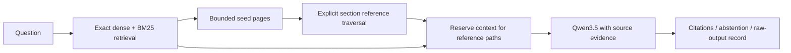

# Insurance graph-assisted RAG research prototype

This document records the earlier 65-source revision. The subsequent
[data-scale revision](DATA_SCALE_RESEARCH.md) expands to 73 sources and adds
external retrieval and real-reference navigation tracks. Its section-address
fix and index schema 4 supersede the earlier parser/index implementation.

This revision studies whether source-supported clause links help retrieve a complete evidence chain under a fixed context budget. It remains a local research prototype. The serving artifact is unadapted Qwen3.5-4B; exact BGE dense search and BM25 supply the initial candidates. No HNSW, graph database, production service, or new fine-tuning is required.

The implementation is a small **local reference-graph RAG**, not a reproduction of Microsoft's community-summary GraphRAG algorithm. The [GraphRAG documentation](https://microsoft.github.io/graphrag/) and [original paper](https://arxiv.org/abs/2404.16130) are conceptual references. This project targets source-level insurance questions rather than corpus-wide thematic summaries.

## Data that can actually be inspected

| Inventory | Historical snapshot | Expanded snapshot |
| --- | ---: | ---: |
| Public source documents | 56 | 65 |
| PDF pages with archived text records | 159 | 322 |
| Archived HTML records | 42 | 42 |
| Total page records | 201 | 364 |
| Retrieval snippets | 1,180 | 1,630 |

The nine added official PDFs contain 167 physical pages, of which 163 have nonempty native text. They cover auto, renters, health, long-term care, property claims, flood, and life insurance. Their original bytes, source URLs, acquisition metadata, SHA-256 hashes, and physical page numbers are preserved. Every added text page was re-extracted and matched against the archived PDF; see [source audit](../reports/graph_research_v1/source_audit.json).

The expanded corpus lives in `data/research_corpus/expanded_public_v1`. The `source_linked_public_v1` variant has the same text/counts plus six source-inspected page references in three original guides; `reference_annotations.json` preserves both endpoint quotes, PDF identity, and printed-to-physical page mappings. This small pilot was added after primary test evaluation and is labeled exploratory. The New Jersey printed page 10 is physical PDF page 12, verified in the rendered PDF. The historical `data/04_curated` snapshot is preserved for earlier experiments. Adding retrieval text does not increase the old SFT dataset or establish new training results. The public-guide benchmark uses uniform 180-word / 120-stride snippets; the union corpus retains the old snippet boundaries and appends the new PDF snippets.

## Graph behavior



- **Candidate relationships** come from overlapping insurance metadata. Their names use `candidate_`, and `relation_status=candidate`. They never establish that an endorsement overrides a clause. The numeric confidence is an uncalibrated ranking heuristic, not a probability.
- **Explicit references** require a literal `See Section ...` or `Refer to Section ...` in source text and a unique matching section heading at the start of a target page, within the same document/packet. Both source spans and their page keys are retained. Ambiguous headings, mismatched explicit policy IDs, and targets in another packet do not link. A reference shows connectivity; it does not prove legal precedence or applicability.
- **Bounded traversal** uses four seed pages, at most two hops, and at most eight expanded pages. Candidate edges are one-hop only. Traversal and tie breaks are deterministic, cycles terminate, and every selected dependency exposes its path.
- **Context selection** can reserve the top-three evidence slots for an explicit neighborhood of a page already ranked in the initial top three. This addresses a failure observed on development cases: finding a dependency does not help if final ranking drops it. This rule can displace unrelated relevant evidence and must be evaluated, not assumed optimal.
- **Ablation switch:** `INSURERAG_GRAPH_MODE=off|explicit|all`. Default `explicit`; `all` also enables candidate metadata expansion when query analysis requests it. Heuristic edges cannot reserve context slots. Old index manifests must be rebuilt because the graph and canonical snippet-to-page mapping changed.

The automatic parser intentionally does not assume that printed “page 8” means physical PDF page 8. The separate annotation path accepts an inspected mapping only when source/target quotes, target printed label, and document scope match. Neither path infers version precedence from dates, performs general entity resolution, resolves every natural-language cross-reference, or decides claims. Broader relation extraction needs additional reviewed data.

## Three complementary experiments

1. **Public-guide QA:** 300 AI-authored questions, 60 development and 240 test, across 25 documents. Development/test document families are disjoint. The test has 180 supported and 60 unsupported cases in 20 documents / 13 families. Actual Qwen generation uses frozen retrieved prompts, BGE embeddings, top-three pages, 8,000 context characters, 2,400 characters per page, an 8,192-token model context, 384 output tokens, temperature 0, and seed 42. This path searches each named document; it is not a global-corpus QA claim.
2. **Global public retrieval:** the same 240 test questions search all 65 sources together, with no gold-document filter. Graph off, explicit references, and candidate-enabled graphs use the same BGE model and context budget. Source titles remain in the natural-language questions. This tests distractor handling separately from generation.
3. **Controlled graph paths:** 120 synthetic questions, split 24 development / 96 test, across 30 invented ten-record packets. Six templates are reused with different values and IDs. Five retrieval arms share the same reranker and top-three context budget. The supported test denominator is 72; the other 24 questions are unsupported and do not receive an abstention score because this experiment runs no LLM. It establishes a controlled mechanism, not unseen-policy generalization.

The [frozen experiment record](../reports/graph_research_v1/freeze.json) identifies the selected code before final test inference. Earlier development outputs and source snapshots remain available. Increasing the page budget alone did **not** improve the exact full-span development retrieval count (29/45 at either budget); no improvement is claimed from that change alone. Literal full-span checks can fail when evidence selection retains the answer but omits an intervening sentence.

The current measured results are collected in [RESULTS.md](../reports/graph_research_v1/RESULTS.md), with raw records linked there. Do not mix synthetic path-completion scores with public-guide answer scores. The strict answer contract combines lexical keys, an actual supplied source, a verbatim quote covering the annotated span, and completed JSON generation; it is not expert semantic accuracy. Conditional accuracy must be read alongside answer coverage. Questions and documents are authored, not a representative customer sample. Cluster bootstrap intervals cannot fix that sampling limitation.

## Reproduce

Use Python 3.11+ and the pinned research environments described in [REPRODUCIBILITY.md](REPRODUCIBILITY.md). Base model weights are not bundled. The minimal test environment requires `requirements-dev.txt`; real local BGE inference additionally requires the documented Torch/Transformers dependencies. Run from the repository root, use a fresh output directory, and select the exact BGE checkpoint and Ollama digest recorded in the reports.

```powershell
python -m pytest -q
python scripts/prepare_research_benchmark_v2.py --validate-only
python scripts/audit_expanded_sources.py --output reports/my_source_audit.json

# Example checkpoint location: change to the locally downloaded BGE directory.
$env:INSURERAG_RETRIEVAL_MODEL='C:/models/bge-small-en-v1.5'
$env:INSURERAG_GRAPH_MODE='explicit'
python main.py build-index data/research_corpus/expanded_public_v1 --corpus-source auto --index-dir data/my-expanded-index --disable-image-signal
python main.py query data/research_corpus/expanded_public_v1 "According to the FEMA NFIP summary, what is actual cash value?" --corpus-source auto --index-dir data/my-expanded-index --disable-image-signal --json

python scripts/prepare_research_benchmark_v2.py --split test --retrieval-model C:/models/bge-small-en-v1.5 --graph-mode explicit --output reports/my_prepared_test
python scripts/eval_research_benchmark_v2.py --prepared reports/my_prepared_test --model qwen3.5:4b --expected-digest 2a654d98e6fba55d452b7043684e9b57a947e393bbffa62485a7aac05ee4eefd --endpoint http://127.0.0.1:11435 --output reports/my_qwen35_test
python scripts/graph_retrieval_study.py run --split test --retrieval-model C:/models/bge-small-en-v1.5 --output reports/my_graph_test
python scripts/eval_expanded_retrieval.py --split test --retrieval-model C:/models/bge-small-en-v1.5 --output reports/my_global_test
python scripts/eval_expanded_retrieval.py --split test --corpus data/research_corpus/source_linked_public_v1 --retrieval-model C:/models/bge-small-en-v1.5 --output reports/my_source_link_exploration
python scripts/demo_source_linked.py --retrieval-model C:/models/bge-small-en-v1.5 --vlm-model ollama:qwen3.5:4b --expected-digest 2a654d98e6fba55d452b7043684e9b57a947e393bbffa62485a7aac05ee4eefd
```

For a no-model CPU smoke, explicitly select `local-hashing` and `local-extractive`. The reported research measurements use real BGE and Qwen, not those baselines. The original demo's historical public snapshot remains available; the commands above select the expanded corpus explicitly. No hosted API or paid provider is activated by these commands.

## Useful next research questions

The highest-value extension is a reviewed collection of actual public policy forms and endorsements with explicit clause identifiers and version relationships. Evaluate ambiguous references, exceptions nested inside exclusions, conflicting dates, scanned tables, and missing documents. Add human semantic judgments before claiming answer accuracy. HNSW becomes a separate speed/recall experiment if exact vector search is a measured bottleneck; insurance graph structure alone is not evidence that approximate nearest-neighbor indexing helps.
