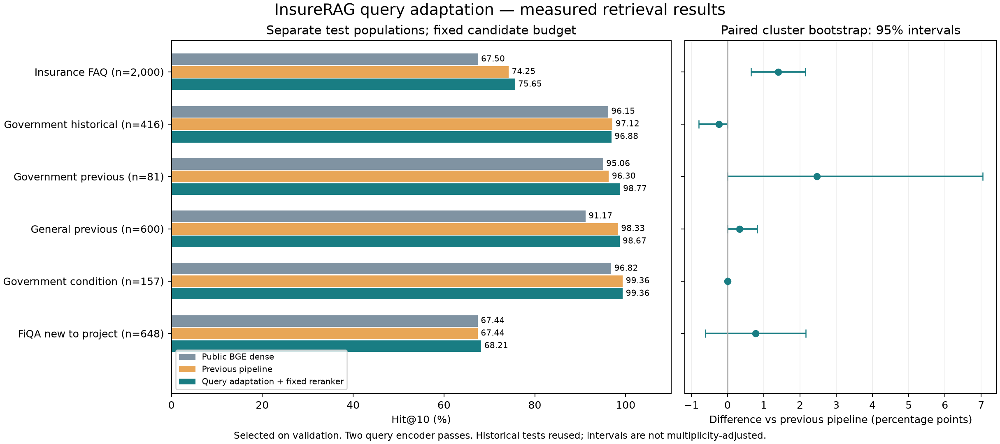

# InsureRAG 查询向量适配：数据扩充、训练与失败分析

本轮实际新增 FiQA 原始问答数据，训练了 BGE 的查询编码器，并完成同预算数据对照。**保险 FAQ 历史测试 Hit@10 从 74.25% 提高到 75.65%，相对公共 BGE 的 67.50% 高 8.15 个百分点。** 这是一项检索召回与排序的局部进步：FAQ 的 Hit@1 下降，金融测试增益尚不确定，不能称为全面改善。

## 固定测试结果

Hit@10 指原始标注答案出现在前十候选中的比例，不是生成答案正确率。原流程与新流程使用相同的 BGE 文档索引、BM25、MiniLM 重排器、融合权重及候选上限；新流程额外计算训练后的查询向量，与原向量各占一半并归一化。**候选预算相同，查询编码成本不同：新流程需要两次查询编码。**

| 测试集 / 题数 | BGE Hit@10 | 原流程 Hit@10 | 查询适配后 Hit@10 | 相对原流程 / 百分点（95% 簇区间） |
| --- | ---: | ---: | ---: | ---: |
| 保险 FAQ 历史测试 / 2,000 | 67.50% | 74.25% | 75.65% | +1.40（+0.65, +2.15） |
| 政府历史测试 / 416 | 96.15% | 97.12% | 96.88% | -0.24（-0.79, +0.00） |
| 此前政府测试 / 81 | 95.06% | 96.30% | 98.77% | +2.47（+0.00, +7.04） |
| 此前通用测试 / 600 | 91.17% | 98.33% | 98.67% | +0.33（+0.00, +0.82） |
| 上一轮政府测试 / 157 | 96.82% | 99.36% | 99.36% | +0.00（+0.00, +0.00） |
| 本轮新增金融测试 / 648 | 67.44% | 67.44% | 68.21% | +0.77（-0.62, +2.16） |

FAQ 相对原流程有 44 胜、16 负，净增 28 道命中；+1.40 个百分点的名义 95% 簇区间为 +0.65 至 +2.15。相对 BGE 为 +8.15 个百分点（+6.71 至 +9.60）。但这些 FAQ 已在历史迭代中用于诊断，并不是新盲测。不同集合使用不同候选库，不合并成一个“总体准确率”。

新增 FiQA 测试为 648 题，搜索全部 57,638 条金融答案：437 → 442 题命中，13 胜、8 负；相对原流程 +0.77 个百分点，区间 -0.62 至 +2.16，不能宣称稳定超越。其余历史测试共 3,254 题；现在累计报告 3,902 题，但不是 3,902 道新保险题。

所有区间使用 5,000 次配对簇 bootstrap：FAQ / FiQA 按共享正确答案的连通分量，政府 / 通用题按来源 URL 或标题。FiQA 缺少原始作者和帖子簇信息，仍可能低估依赖；多个指标和集合未作多重比较校正。

| 测试集 | 原流程 Hit@1 → 新 Hit@1 | 原流程 MRR@100 → 新 MRR@100 |
| --- | ---: | ---: |
| 保险 FAQ 历史测试 | 44.80% → 44.00% | 0.5508 → 0.5483 |
| 政府历史测试 | 71.39% → 73.08% | 0.8122 → 0.8221 |
| 此前政府测试 | 82.72% → 81.48% | 0.8825 → 0.8786 |
| 此前通用测试 | 88.33% → 88.67% | 0.9249 → 0.9268 |
| 上一轮政府测试 | 80.89% → 80.89% | 0.8812 → 0.8818 |
| 本轮新增金融测试 | 40.12% → 40.90% | 0.4961 → 0.4997 |

FAQ 首位命中率下降 0.80 个百分点（名义区间 -1.55 至 -0.05），MRR 下降 0.00252（-0.00681 至 +0.00182）。因此本次选定配置适合继续研究前十证据检索，不能说成首条答案质量更好。政府历史集少命中 1 题也已保留。

纯向量对照同样保留：FAQ 的 BGE Hit@10 为 67.50%，混合查询向量的纯向量结果为 67.35%；FiQA 为 67.44% → 66.05%。最终改进依赖与固定重排器及分数融合的配合，不能宣称“训练后向量模型本身全面优于 BGE”。完整七种检索对照及 nDCG、标签召回见 `test_metrics.csv`，包括 BM25、BGE、RRF、原流程、适配向量、适配 RRF 和选定流程。

## 为什么改变训练方向

上轮 FAQ 剩余 515 道未命中中，194 道的标注答案连联合候选池都没进入。单独继续训练重排器不能挽回这部分题。对这些题的原始 BGE 正例排名检查显示中位数为 295；扩大两个检索器深度到 200 可覆盖其中 79 题，到 500 可覆盖 142 题。这只是历史诊断，本轮没有借此扩大测试候选预算。

本轮改为只训练查询编码器，保持文档向量不变：对每题的全部可用文档向量做多正例 softmax，并用原始 BGE 查询分布的 KL 约束减轻漂移。已知正确答案的重复文本同时作为正例，不互当负例。共有 100,465 个可用文档向量进入训练分母，显式屏蔽新增留出正例、重复文本和政府留出来源。原 InsuranceQA 的共享答案标签仍然存在，不能描述成所有历史题的 source-disjoint 评估。

方法受到查询端适配工作的启发，但不是 ADORE 的精确复现：这里使用固定全文档分母，没有复制其动态采样流程。[ADORE / STAR 论文](https://arxiv.org/abs/2104.08051)。查询前缀、CLS pooling 和 L2 归一化按 [BGE 作者说明](https://huggingface.co/BAAI/bge-small-en-v1.5) 保持一致。

## 数据规模与训练事实

| 项目 | 数量与来源 |
| --- | --- |
| 本轮唯一训练问题 | 31,351：11,629 保险 FAQ、259 政府、13,999 通用、5,464 金融 |
| 与上轮相比 | 25,987 → 31,351；新增 5,464 FiQA 题，同时额外排除 100 道旧近重复题；净增 5,364 |
| FiQA 原始划分 | 5,500 训练 / 500 验证 / 648 测试，57,638 条原始答案 |
| 新金融正例关系 | 13,967 条；未生成伪标签 |
| 混合训练答案库 | 105,810 条；隔离后 100,465 条参与训练分母 |
| 验证集 | 3,027 题：2,000 FAQ、127 政府、400 通用、500 金融 |
| 主实验 | 两种子 42 / 123，每个 2 epochs；共 6,284 次优化更新、201,028 次问题呈现 |
| 数据对照 | 另两次同预算运行；总计四次训练、八份 epoch 权重、12,568 次更新、402,056 次问题呈现 |

重复呈现不是新增样本。模型含 33,360,000 个可训练参数，每个运行每轮 50,257 次呈现，micro-batch 16、累积 2、学习率 8e-6、温度 0.05。每个主实验运行约 4 分钟 GPU 训练；数据准备、向量编码、各项评估与审计不计入训练时间。所有八份权重均核对哈希和实际参数变化，无虚构训练。

FiQA 来自 [BEIR 官方下载索引](https://github.com/beir-cellar/beir) 和 [FiQA 数据卡](https://huggingface.co/datasets/BeIR/fiqa)，保留原始问题、答案与相关性标签；逐条核对了导入数据。原始 zip MD5 为 `17918ed23cd04fb15047f73e6c3bd9d9`，数据卡声明 CC-BY-SA-4.0，归属及版本记录在 `provenance.json`。它是历史金融论坛语料，不全部属于保险，也不是现行保险或税务规则库。关键词筛出的新增训练保险相关题仅 127 道、测试仅 15 道；这不是专家标注。

有一项必须披露的近重复：FiQA 测试题 `fiqa_q_3446` 与此前固定重排器的一道训练题近似，主题为 term / whole life 区别。该旧训练题已从本轮查询训练中排除，但无法撤销旧重排器的历史接触。主结果保留全部 648 题；排除此题后 647 题为 67.39% → 68.16%，结论不变。公共预训练阶段是否接触这些公开数据未知。15 道保险关键词测试子集为 80% → 80%，不支持新增保险泛化结论。

## 新增数据究竟贡献了多少

为区分“继续训练”和“金融监督数据”的作用，另用旧题重放替换全部 5,464 个金融题槽位，保持种子、epoch、更新步数、分母文档、槽位重复次数及 KL 系数相同。对照实际仅有 25,887 道唯一旧题；未标注的金融文档仍在两组分母内。因此这项实验比较的是新增金融监督，不能单独衡量新增金融文档的作用。

该对照在看到主实验验证结果之后、评分新测试之前登记；只看验证集，不参与改选模型，不冒充完全事先设计的独立测试消融。在主实验选定配置上：

| 验证域 | 旧题重放 Hit@10 | 新增金融监督 Hit@10 | 差值 / 百分点（95% 簇区间） |
| --- | ---: | ---: | ---: |
| FAQ / 2,000 | 75.95% | 76.05% | +0.10（-0.15, +0.40） |
| 政府 / 127 | 94.49% | 94.49% | 0.00（0.00, 0.00） |
| 通用 / 400 | 98.25% | 98.25% | 0.00（0.00, 0.00） |
| 金融 / 500 | 68.20% | 68.60% | +0.40（-0.60, +1.60） |

这些区间均包含零，金融 MRR 在该对照中反而下降 0.00463。八组匹配的种子 / epoch / 混合比例结果全部保留，FAQ 差值有正有负。**目前没有充分证据把本轮测试收益归因于“多加了金融数据”。** 查询适配流程有收益，新增监督的独立贡献仍需验证。

## 失败案例与仍未解决的问题

| FAQ 失败阶段 | 原流程 | 新流程 |
| --- | ---: | ---: |
| 前十命中 | 1,485 | 1,513 |
| 正例未入联合候选 | 194 | 176 |
| 正例在候选中、但排到十名后 | 321 | 311 |

原来的 194 道候选缺失题，有 28 道重新进入候选、其中 6 道最终命中前十；同时产生 10 道新候选缺失。另 38 道前十获益来自原本已有候选的题。召回扩大了可用证据，但 311 道题仍在排序环节失败。不是所有改善都能单独归因于候选召回，查询相似度、候选组成与分数归一化也同时改变。

以下为助手核对原始文本后的诊断，不是专家对保险事实或标签的重新裁定：

| 案例 | 原流程 → 新排名 | 诊断 |
| --- | --- | --- |
| `iqa_v2_test_00982`：租客盗窃索赔需要多久 | 不在候选 → 第 4 | 找回描述报案、财物清单与理赔审核步骤的标注段落；首条仍不直接回答时长 |
| `iqa_v2_test_00249`：定期寿险到期后怎样 | 第 7 → 第 14 | 首条强调缴费结束与无现金价值，标注答案包含续保、转换和返还保费条件；条件优先级仍不足 |
| `iqa_v2_test_00104`：是否每州都要求车险 | 第 10 → 第 17 | 检索结果和原标注包含不同历史规则表述；需要日期与辖区上下文，不能只优化语义相似度 |
| `gov_question_4924a26a39212ae5`：第三方适应 DRA 要求的时间 | 第 9 → 第 12 | 混同系统改造期限和医疗索赔提交期限，数字与适用主体没有被充分区分 |
| `fiqa_q_622`：提前取出定期存款 | 第 11 → 第 9 | 标注答案进入前十，首条却在讲关闭账户的记录保存；Hit@10 获益不能等同于首答可用 |

完整 777 张失败或排名翻转卡片包括所有任一流程未命中的题，保留原题、标注答案、前三候选和完整候选内正例排名；未删坏例、未重标测试。`failure_cases.json` 和 `failure_analysis.json` 可复查每个结论。

当前训练使用全候选分母，未标注但可能正确的答案仍会被当作负例，KL 约束只能减缓这一问题。历史 FAQ 标注不完整，时间与条件冲突需要人工核查。既有政府抽取边界问题也仍保留在本轮冻结数据里，未用修复后的段落重刷分数。

## 选择顺序与工程核验

主实验在训练前锁定两种子 × 两个 epoch × 两个混合比例，以及原流程对照，共九组验证配置；按 FAQ 0.6、金融 0.2、政府 0.1、通用 0.1 加权 Hit@10，施加各域回退限制。选出 seed 42 / epoch 2 / alpha 0.5 后只评分这一配置的新测试。选择锁、代码、数据、文档索引、模型与逐题分数均保存 SHA-256。

原流程在 3,254 道历史题上的逐题 Hit@1/5/10/100、MRR 和标签召回完全复现旧记录；84 道题的 top-100 列表顺序存在差异，但没有改变上述指标，另存数值核查记录。不能把这种指标一致称为逐项排名完全一致。

预处理遇到 Unicode 行分隔符与旧读取器不兼容，已在第一次实际向量计算前使用等价 JSON 转义修复，并保留原对象等价验证和初始清单。权重检查发现原始 BGE 保存了固定 `position_ids` 缓冲区，而 Transformers 5 不保存它；验证其恰为 0–511 后，仅将该非学习缓冲区排除出参数差异计数。冻结训练 / 评估实现和数据标签未因测试结果而修改。

完整环境 302 项测试及 58 项子测试通过；最小依赖环境 275 项通过、13 项按依赖跳过，另有 58 项子测试通过。三个真实权重查询入口均完成冒烟检查。脚本加载模型、读索引并实际重排，未调用生成模型；其用时包含冷启动，不能作为稳态在线延迟指标。

本轮没有训练 Qwen、构建新图谱或测试 HNSW；这是独立的检索 research prototype。下一步更值得验证的是主体 / 资格 / 时间条件的专家标注与首位排序目标，而不是无差别继续堆通用金融题。新 FiQA 测试现在也已被查看，未来迭代应新增独立来源留出集。

使用与复现见 [QUERY_ADAPTATION_REPRODUCTION.md](QUERY_ADAPTATION_REPRODUCTION.md)。主报告数据位于 `reports/query_adaptation_v1/`，本轮只修改本地工作区，未推送 GitHub。
