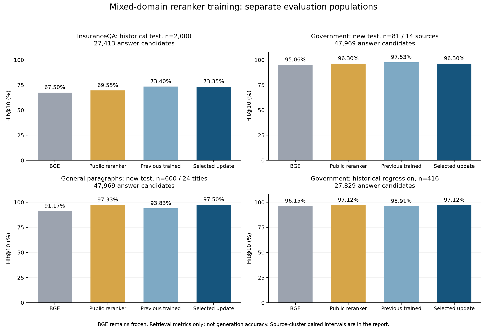

# InsureRAG：扩充训练数据与恢复跨来源检索能力

更新日期：2026-10-01。本轮完成真实的数据扩充、模型训练、验证选模与测试，定位仍是 research prototype。

**最终选中第二轮 MiniLM 排序模型，使用单模型推理。训练问题从 11,729 增至 19,941（+70.0%），新增 681 道按来源隔离的测试题。**

这 681 题包括 **81 道政府问答和 600 道通用问答**，并非全部是保险业务题。旧 2,000 道 InsuranceQA 和 416 道政府问答保留为历史回归；不同人群、任务和候选库分开报告。

## 实测结果

Hit@10 表示前十条结果中命中至少一个原标注答案。公开排序器为原 MS MARCO MiniLM；上一轮为 InsuranceQA 领域训练模型。BGE 编码器保持固定。

| 测试集 | 题数 | BGE | 公开排序器 | 上一轮训练 | 本轮训练 |
| --- | ---: | ---: | ---: | ---: | ---: |
| InsuranceQA 历史测试 | 2,000 | 67.50% | 69.55% | 73.40% | 73.35% |
| 本轮新政府问答 | 81 | 95.06% | 96.30% | 97.53% | 96.30% |
| 本轮新通用问答 | 600 | 91.17% | 97.33% | 93.83% | 97.50% |
| 政府历史回归 | 416 | 96.15% | 97.12% | 95.91% | 97.12% |

保险历史测试搜索 27,413 个答案；本轮新增测试搜索 **47,969 个答案**；政府历史回归搜索 27,829 个答案。所有对照在各自测试内使用完全相同的候选库和候选列表，没有强行插入标准答案。

首位命中和排序质量也需一起看：

| 测试集 | 上一轮 Hit@1 | 本轮 Hit@1 | 上一轮 MRR@100 | 本轮 MRR@100 |
| --- | ---: | ---: | ---: | ---: |
| InsuranceQA 历史测试 | 43.20% | 43.20% | 0.5386 | 0.5383 |
| 本轮新政府问答 | 80.25% | 80.25% | 0.8669 | 0.8652 |
| 本轮新通用问答 | 74.67% | 85.33% | 0.8204 | 0.9033 |
| 政府历史回归 | 70.19% | 72.12% | 0.7975 | 0.8159 |

## 差异与不确定性

| 测试集 / 对照 | Hit@10 差异（百分点） | 配对 95% 区间 | 新增命中 / 失去命中 |
| --- | ---: | --- | ---: |
| InsuranceQA 历史测试 / 上一轮 | -0.05 | [-0.65, +0.55] | 19 / 20 |
| InsuranceQA 历史测试 / 公开排序器 | +3.80 | [+2.70, +4.95] | 108 / 32 |
| InsuranceQA 历史测试 / BGE | +5.85 | [+4.70, +7.14] | 143 / 26 |
| 本轮新政府问答 / 上一轮 | -1.23 | [-5.00, +0.00] | 0 / 1 |
| 本轮新政府问答 / 公开排序器 | +0.00 | [+0.00, +0.00] | 0 / 0 |
| 本轮新政府问答 / BGE | +1.23 | [+0.00, +3.70] | 1 / 0 |
| 本轮新通用问答 / 上一轮 | +3.67 | [+2.39, +5.05] | 22 / 0 |
| 本轮新通用问答 / 公开排序器 | +0.17 | [+0.00, +0.55] | 1 / 0 |
| 本轮新通用问答 / BGE | +6.33 | [+4.45, +8.18] | 38 / 0 |
| 政府历史回归 / 上一轮 | +1.20 | [+0.28, +2.24] | 5 / 0 |
| 政府历史回归 / 公开排序器 | +0.00 | [+0.00, +0.00] | 0 / 0 |
| 政府历史回归 / BGE | +0.96 | [-0.47, +2.58] | 6 / 2 |

政府问答按来源 URL、通用问答按 Wikipedia 标题做 5,000 次簇 bootstrap；历史 FAQ 按共享答案标签连接成簇。新政府测试只有 **81 题、14 个来源**，单题变化就是约 1.23 个百分点，不能把小幅点估计差异解释为稳定胜出。以上区间不是多个比较校正后的显著性结论。

本轮在保险 FAQ 历史测试的 Hit@10 为 73.35%，低于上一轮 73.40%。因此保留原领域模型和原查询入口；本轮作为恢复跨来源能力的可选研究模型，不能写成全线提升。

沿用原来的近似重复标记，排除后还有 1,524 道历史 FAQ：BGE 68.77%、上一轮 74.02%、本轮 74.15%。这是固定的历史敏感性分析，不能将历史测试重新称作盲测。

全部退步题和改善题都保留在 [error_analysis.json](../reports/retention_v2/error_analysis.json)，包含问题、原标签答案和新旧结果。未因分数删除题目或改标签。

新政府测试唯一失去 Hit@10 的题涉及“退休人员与长期伤残人员共同参保”的特殊计划。正确原文是该特殊情形的过渡监管说明；新模型将更一般的退休人员豁免解释排到首位，原标注答案由第 3 名降至第 24 名。相近资格人群与时效条件仍是薄弱点；这是排序失败分析，不是修改标签的依据。

## 新增数据与训练

| 项目 | 规模 / 做法 |
| --- | --- |
| 原 InsuranceQA 训练题 | 11,729 道去重、去留出集重复题 |
| 新政府训练题 | 213 道，28 个来源 URL，原机构问答 |
| 新通用训练题 | 7,999 道，442 个 Wikipedia 标题，SQuAD 原始人工问题 |
| 新验证集 | 政府 127 + 通用 400；另用原保险验证 2,000 题 |
| 新测试集 | 政府 81 / 14 来源 + 通用 600 / 24 标题 |
| 混合候选库 | 47,969 个答案或段落；新增 20,556 个 |
| 训练正负例 | 27,405 个可用正例对、179,469 个难例/随机负例对 |
| 最终教师缓存 | 206,874 对；模型预测不是人工标签 |
| 实际训练 | 2 个 epoch、2,574 次参数更新、246,960 次问答对呈现 |
| 两轮实际不同问答对 | 24,484 个正例对 + 139,926 个负例对 |

训练耗时 569.2 秒，记录的峰值 GPU tensor 分配约 1.68 GiB（不等于整卡峰值占用）。政府问题每轮呈现 4 次；重复呈现未计为新样本。

从上一轮选中的模型继续做全参数训练，使用监督排序 loss 加公开教师的 KL 约束，同时混入通用问题，尝试缓解能力遗忘。学习率 5e-6、有效 batch 16、BF16 autocast、固定种子 42。BGE 负责召回，训练对象是 22.7M 参数的 MiniLM cross-encoder。

参数比对确认：相对上一轮模型，105 个张量、22,372,706 个参数值发生变化。选中权重 SHA-256：`f97de794d7035317f083f36741a4c3c2aaca4bab689b276a4f4d8c314f6208ac`。

## 选模与自查

先冻结两轮检查点与三档公开模型混合权重，再用保险、政府、通用三组验证指标的等权宏平均选模。要求保险 Hit@10 不比上一轮低超过 0.5 个百分点，另两域不比公开模型低超过 1 个百分点。最终选中 epoch 2、模型权重 1.0；测试前已锁定。公开教师只参与训练约束，最终查询无需双模型融合。

本轮真实完成两项数据问题自查：

- 初版负例含有 3,916 对来自新留出来源的段落，涉及 2,522 组问题。验证前中止该训练，重新采样，从上一轮模型重新训练。最终正负例均不含新留出来源文本；废弃记录保留。
- 两道 SQuAD 训练题的规范化段落存在标点差异，原字符偏移不能直接套到规范化段落。已对原文和规范化等价关系分别验证，保留差异记录。政府材料另外有 8 条上下文/脚注质量标记，未按模型结果筛题。

训练组无重复问题，正负例无文本重叠，421 条政府问答原文位置和 8,999 条 SQuAD 原始标注已机械校验。模型、数据、代码、原始分数及选模时间均有哈希和运行记录。272 项测试通过，另有 58 个子测试；最小依赖环境为 258 通过、8 跳过。

## 如何使用与如何描述

新增 [查询入口](../scripts/query_retention_reranker.py) 支持原保险答案库、混合答案库和 78,830 条 HICRIC 片段；三种语料范围分别标明。原查询入口继续保留。运行命令、协议与数据来源见 [复现说明](RETENTION_REPRODUCTION.md)。

这轮提供的是更充分的检索研究证据，不能转写成 Qwen 或 GraphRAG 的生成准确率、幻觉率，也不能证明复杂保险合同推理。BGE 单独检索与加排序器的系统计算量不同。SQuAD 是派生的段落检索，不是官方 span EM/F1。

仍有以下边界：只有一个训练随机种子；混合数据与 KL 同时改变，尚未分离各自贡献；政府标签来自机械抽取，未经保险专家独立复核；未标注的合理答案会影响分数；公开模型预训练可能见过公开测试来源。政府归档不能当作现行政策。

原始结果：[新测试及 FAQ 回归](../reports/retention_v2/test_evaluation/summary.json)、[政府历史回归](../reports/retention_v2/historical_government/summary.json)、[验证与选模](../reports/retention_v2/selection.lock.json)、[最终校验](../reports/retention_v2/verification.json)。
